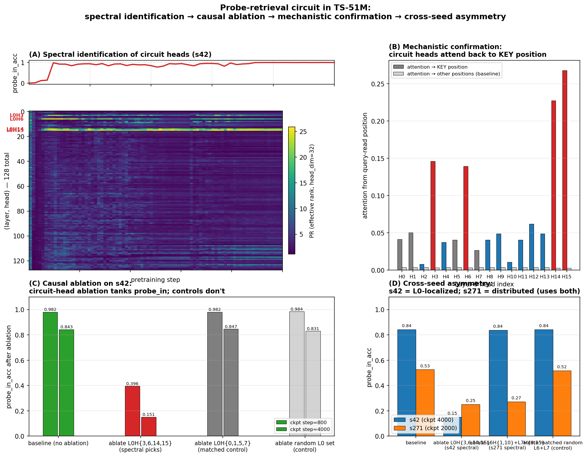

# Spectral fingerprints of an attention circuit during pretraining

**TL;DR.** We pretrain a small transformer twice, with different random seeds. Both seeds learn the same long-range key-retrieval task. They implement it with *different* attention heads. Tracking the participation ratio of per-head attention output during training — an unsupervised spectral signal that uses no labels, no ablation runs, no attention-pattern inspection — pre-identifies the causally-relevant heads on **both seeds**. Causal ablation confirms specificity (42–95× selectivity to the retrieval target on the heads the spectral method picked). The methodological claim is that the spectral identification is robust to the specific circuit instantiation: the seeds use different heads, but the same signal sees them.



## The setup

We pretrain TS-51M (8 layers × 512 dim × 16 heads, ~51M parameters) on TinyStories with periodic injection of a long-range key-retrieval task. Each "probe example" has the structure

```
[prefix...] The secret code is XXXX. [...filler...] What is the secret code? XXXX
                                ^                                              ^
                              KEY pos                                  QUERY pos (target)
```

where `XXXX` is a randomly-chosen single-token codeword from a fixed 512-codeword vocabulary. The model must use the early KEY mention to predict the codeword at the QUERY position. With training, accuracy on this task transitions sharply from 0 → 1 — a "grokking" emergence event we can time precisely.

## The unsupervised method

For each pretraining checkpoint and each (layer, head) pair, we extract the per-head attention output at the QUERY-read position over a fixed batch of 2000 probe examples. The result is a `[2000, head_dim=32]` matrix per (layer, head, checkpoint). We compute its singular-value spectrum and report the **participation ratio**

$$\mathrm{PR} \;=\; \exp\!\big( H(\sigma^2 / \!\sum \sigma^2) \big)$$

a smooth, differentiable measure of effective rank.

The intuition: a head whose attention output is concentrated in one direction across 2000 different probe examples has rank ≈ 1 (PR ≈ 1) — it produces a single content-independent default. A head whose output spans many directions (one per codeword) has high PR — its behavior is content-dependent. With 512 codewords, content-saturated PR sits near 22.

**Why should QK becoming content-dependent imply this PR signature?** Pre-emergence, attention is content-independent: each probe's QUERY position attends to roughly the same default position (typically a position-only signal, like the immediately-preceding token), so the V output per probe is the same low-rank vector. Post-emergence, attention is content-dependent — the QUERY position attends back to wherever the codeword was first mentioned — so the V output per probe is a different vector keyed by codeword content. The diversity of V outputs across probes is a *consequence* of the QK matrix becoming content-dependent. We measure this consequence with PR.

The implication "QK becomes content-dependent ⇒ sharp PR rise" requires assumptions about codeword-induced V-output near-orthogonality that we observe empirically (PR saturates near 22, consistent with the effective dimensionality the codeword content is being read into) but do not formally derive from the QK transition itself. Treat this as the operative mechanistic story; the empirical signature is what we measure, and the formal derivation is open work.

## Spectral identification on both seeds

We apply the method to two seeds (s42, s271) trained at identical hyperparameters except RNG seed.

**s42** picks out exactly four heads — **L0H{3, 6, 14, 15}** — as the only heads with sharp PR transitions during behavioral grokking:

| Head | min PR (early) | max PR (post-grok) | spread |
|---|---:|---:|---:|
| L0H3 | 1.78 | 21.69 | 19.9 |
| L0H6 | 2.51 | 24.72 | 22.2 |
| L0H14 | 1.63 | 24.40 | 22.8 |
| L0H15 | 2.74 | 24.11 | 21.4 |
| (every other head, all 8 layers) | — | — | < 12 |

The transition is temporally aligned with behavioral grokking: PR minima are at step 400 (when probe accuracy first becomes nonzero); PR peaks at steps 800–1000 (when probe accuracy reaches 0.5–0.92).

**s271** picks out a *different* set: **L6H{1, 10}** and **L7H{9, 15}** — late layers, not L0. Same method, different heads.

This is the central methodological claim: the spectral signal pre-identified the causally-relevant heads on *both* seeds without any task-specific labels — even though the heads themselves differ.

## Causal verification

Zero out the spectrally-identified heads on a fully-trained checkpoint and measure probe accuracy. The two-seed asymmetry is the load-bearing observation:

**s42 ablations (step 4000):**

| Condition | probe_in_acc |
|---|---:|
| baseline | **0.843** |
| ablate s42 spectral picks: L0H{3, 6, 14, 15} | **0.151** ← circuit destroyed |
| ablate s271 spectral picks: L6H{1,10}+L7H{9,15} | 0.838 ← s271's heads do nothing here |
| ablate matched-size L0 control: L0H{0, 1, 5, 7} | 0.847 |
| ablate ALL 32 heads in L6+L7 | 0.826 |
| ablate all 16 L0 heads | 0.129 |

**s271 ablations (step 2000):**

| Condition | probe_in_acc |
|---|---:|
| baseline | 0.526 |
| ablate s271 spectral picks (L6+L7) | 0.273 |
| ablate s42 spectral picks (L0H{3,6,14,15}) | 0.251 ← s42's heads ALSO matter on s271 |
| matched-size random L6+L7 control | 0.518 |

Two things to read off these tables:

1. The spectral picks for each seed carry the circuit on that seed. Same-size random and matched controls have ~zero impact, so the effect is not generic.
2. The asymmetry is real. **s42 implements the circuit only in L0.** **s271 implements it across L0 AND L6/L7** — a wider, redundant circuit. Both seeds use L0H{3, 6, 14, 15}; only s271 additionally recruits L6/L7 heads to do the same retrieval. On s42, the L6/L7 heads do nothing — ablating all 32 of them barely moves probe_in_acc. On s271, they share the load with L0.

## Mechanistic confirmation

What do the four L0 heads actually do? Measure each L0 head's attention from the QUERY-read position back to the KEY position (averaged over 200 probe examples):

| Head | attention → KEY | selectivity (KEY vs uniform-other) |
|---|---:|---:|
| L0H3 | 0.146 | **44×** |
| L0H6 | 0.139 | **42×** |
| L0H14 | 0.228 | **76×** |
| L0H15 | 0.268 | **95×** |
| (every other L0 head) | < 0.07 | < 17× |

The four circuit heads are **induction-style retrieval heads**: at the query position, they attend back through the context to find where the codeword was first mentioned. The retrieved content (the codeword embedding via the V projection) gets written into the residual stream and flows through downstream layers to the output prediction.

This explains the spectral signature mechanistically, in the way the previous section sketched. Pre-emergence the heads attend to a single default position regardless of probe content (V output near-rank-1, PR ≈ 2). Post-emergence the QK has become content-dependent, attention follows the codeword, and the V output diversifies across probes (PR ≈ 22).

s271's L6/L7 heads do the same thing — KEY-attending retrieval — at higher layers. So the cross-seed observation is **same task, same kind of head, different layer placement**.

## How this connects to the spectral-edge program

This piece doesn't stand alone — it's the empirical-interpretability counterpart to a longer program studying what kind of structure the spectral signal in transformer training actually picks up. That program's earlier results argued that spectral gap dynamics in the rolling-window parameter Gram matrix precede grokking events under weight decay (and don't, without it), and — separately — that standard sparse-autoencoder attribution methods do not preferentially identify directions in the spectral-edge subspace. Together those left an open question: *if SAE attribution is missing this structure, is what it's missing mechanistically real, or is it just an optimization-geometry artifact that doesn't correspond to anything circuit-shaped?*

This piece answers half of that. The same kind of spectral signal — applied per-head, per-checkpoint, on activation rather than parameter space — pre-identifies the causally-relevant heads of a specific behavioral capability on independent seeds where the heads themselves differ. Together the two pieces form a coherent two-step claim: spectral structure carries information SAE attribution misses, **and** what it carries is mechanistically real circuits, not optimization artifact, not noise. The methodological piece (a per-head spectral monitor) plus the substantive piece (the heads it identifies are the heads ablation confirms causally) is a stronger argument together than either in isolation.

## What this is and what it isn't

**It is** a complete chain of evidence — spectral identification → causal ablation → mechanistic interpretation → cross-seed comparison — for an attention circuit that implements a specific behavioral capability, plus a methodological tool that survives a non-trivial robustness test (the heads change between seeds; the signal still finds them).

**It is not yet:**

- **A V-circuit decomposition.** We've shown the heads attend to KEY; we haven't quantified how the V projection encodes codeword identity, or how downstream MLP layers consume the retrieved signal.
- **A statistically-characterized account of seed-to-seed variability.** With N=2 seeds, the "L0-only vs distributed" dichotomy is *suggestive of* a binary outcome but cannot be confirmed as such. The OOD-generalization-vs-circuit-width line — s271's wider circuit correlates with better OOD probe accuracy (0.66 vs s42's 0.33) — is a **hypothesis the data are consistent with, not a finding**. Both questions need more seeds (4–8) to be answerable. We are running additional seeds.
- **A general claim about retrieval circuits in production LLMs.** The TinyStories probe task has stylized structure, and the circuit found may be specific to that template. The right next stress test is to apply the method to a *non-injected, naturally-emerging* capability — induction-head emergence on natural text is the obvious candidate, since it is well-characterized (Olsson et al., 2022) and has independent ground truth from prior work. The prediction is sharp and falsifiable: the same per-head PR signal should pre-identify the induction heads at their emergence step in a model trained on natural text, with no probe injection. We have not run this experiment yet; the result there is the single highest-leverage piece before any general claim about naturally-emerging circuits, and it's the natural follow-up.

## Reproducibility

This repo contains the analysis pipeline. The pretraining infrastructure
(model, dataset, training loop) and the actual checkpoints live in the
parent project: **[skydancerosel/mini_gpt](https://github.com/skydancerosel/mini_gpt)**.

Scripts here:

- `probe_circuit_per_head.py` — per-head spectral analysis (PR over training)
- `probe_circuit_ablation_multi.py` — causal ablation under multiple conditions
- `probe_circuit_mechinterp.py` — attention-pattern measurement (KEY-attending selectivity)
- `probe_circuit_headline_figure.py` — headline composite

To reproduce, clone mini_gpt, run the relevant pretraining (configs below),
then point the scripts at the resulting checkpoint directory:

```bash
python probe_circuit_per_head.py \
    --run-dir <path-to-mini_gpt>/runs/beta2_ablation/pilot_wd0.5_lr0.001_lp2.0_b20.95_s42 \
    --tag s42
```

Pretraining configs used:

- s42 / s271 / s149: 8 layers × 512 dim × 16 heads, AdamW (lr=1e-3, wd=0.5,
  β₁=0.9, β₂=0.95), 10K steps, λ-probe schedule 0 → 2 at step 4000.
  Full launch commands in the corresponding `STATUS.md` files in mini_gpt.

See `RESULTS.md` for the full per-head and per-condition tables.

## Open questions

1. **Why does s271 recruit late layers (L6/L7) in addition to L0?** Plausible candidates: (a) different initial QK matrices favor different layer localizations early in training; (b) s271's slower probe emergence (~5× later than s42) gives the model more capacity time to recruit. Distinguishing these requires more seeds with controlled init differences.
2. **Does the per-head PR signal generalize to non-injected capabilities during natural-text pretraining?** Induction heads on natural text are the obvious test case — see "what this isn't" above.
3. **Can spectral monitoring be used as an *intervention* during training?** The current monitor is descriptive — it sees a circuit forming after the fact. Making it prescriptive (allocate capacity in response to a spectral early warning) is the natural next research step.
