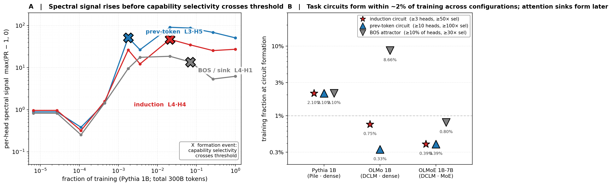
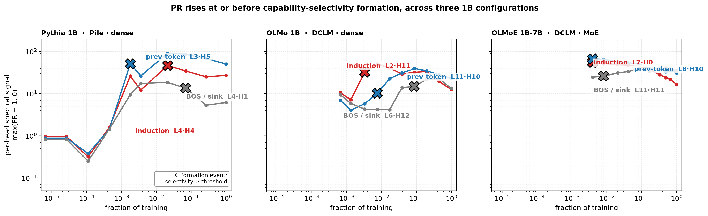
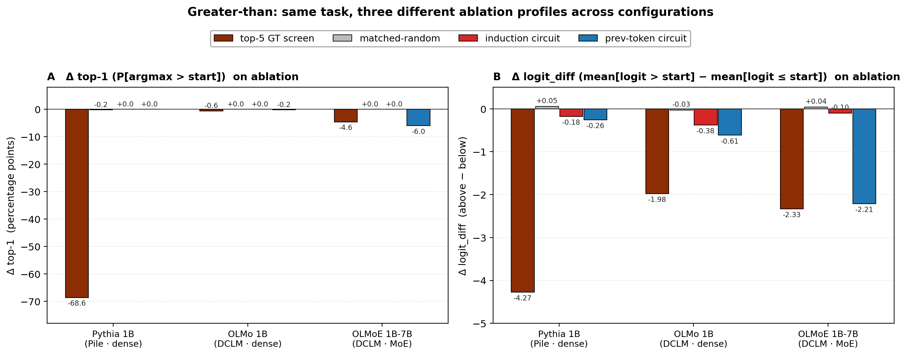
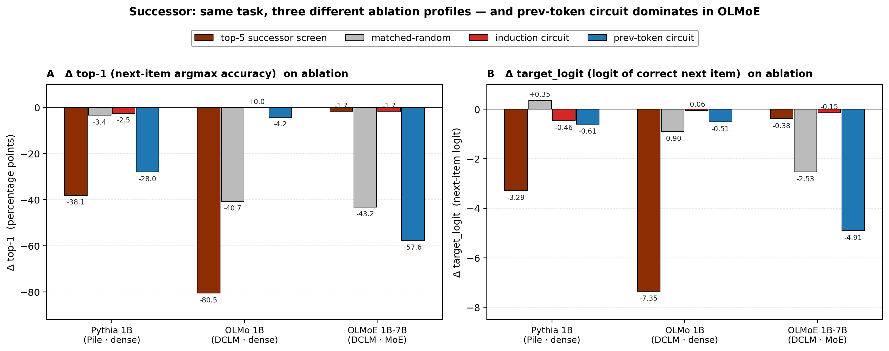
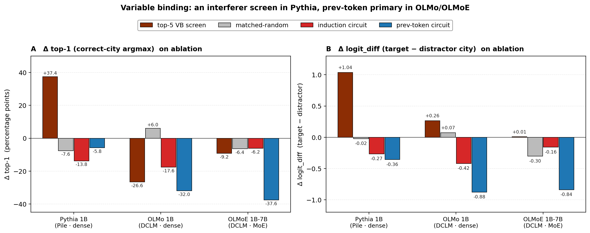

# Spectral Probe-Circuits Across Architectures

**A three-step recipe for identifying attention-head circuits in pretrained language models, with cross-architecture validation and an explicit scope statement on pattern-vs-task-causal decoupling.**

---

## Abstract

We present a three-step recipe for identifying attention-head circuits in pretrained transformers: (1) a *spectral signal* (the time-integrated participation ratio of per-head attention output during training) that surfaces heads doing sustained content-dependent computation, (2) a *task-pattern screen* over all heads that filters by the specific attention pattern the target task requires, and (3) a *causal verification* by group ablation against a matched-random control. The recipe is validated across six pretrained language models spanning two architecture families (dense transformer, MoE) and three training pipelines (a small synthetic-probe model, Pile, DCLM), on two capability classes (induction, previous-token) and one composed task (Indirect Object Identification, IOI).

Three findings:

1. **The recipe ports.** Across all six models, the screen identifies small (3–13 head) circuits causally necessary for the screen-relevant task. Induction circuits are 3–6 heads in 124M–1B dense models and 4 heads in 1B-7B MoE — sublinear in model size. The previous-token circuit is 8–9 heads in 1B-class models.

2. **The recipe is predictive, not retrospective.** The capability-specific screen applied at intermediate training checkpoints recovers the final-checkpoint induction circuit using 0.3–2% of total training tokens. Per-head PR rises before induction selectivity crosses threshold for every final-checkpoint induction head sampled.

3. **The specific screen does not port across model families for composed tasks.** On IOI, the prev-token-circuit screen is the causal circuit for Pythia 1B (Δ−82pp on ablation), is inert for OLMo 1B, and *helps* IOI when ablated in OLMoE 1B-7B. The name-mover screen is the causal circuit for OLMoE (30× over matched-random), partial for OLMo (1.5×), and a *correlate* of IOI in Pythia (ablating it helps). An S-Inhibition screen is the causal circuit for OLMo (∞ differential), a real secondary mechanism in Pythia, and inert for OLMoE top-1. Four candidate screens cover the IOI circuit across the three models, but the *primary* screen differs by model and must be validated by ablation. Circuit-level mechanistic findings on one model are not safe to assume on another, even at the same scale.

In addition, three cross-panel invariants hold: L0–L1 produce zero BOS-classified heads in every model tested at every training checkpoint sampled; whole-model BOS-class fraction at the final checkpoint scales with training data (DCLM > Pile by ~20pp) and architecture (dense > MoE by ~10pp at the same scale+data); capability circuit size scales sublinearly with parameter count.

The task circuits a model is learning are identifiable from within the first ~2% of pretraining, and the per-head spectral signal that surfaces them at the end of training is detectable at intermediate checkpoints — typically two checkpoints (on a log-spaced grid) before the capability-selectivity threshold is crossed, with the prev-token signal co-emerging at threshold and the BOS-attractor signal leading by four checkpoints. This holds across three 1B-class configurations spanning two architectures (dense, MoE) and two pretraining datasets (Pile, DCLM). Circuit formation at this scale is a training-time observable.

**Figure 1. Capability circuits emerge early in pretraining and the per-head spectral signal precedes their formation.** **(A)** Per-head spectral signal at each checkpoint — `max(PR_t − 1, 0)`, where PR is the participation ratio of the per-head attention output's singular-value spectrum across the evaluation batch; this is the *integrand* of the PR-integral ranking statistic defined in §3.2, plotted per-checkpoint rather than as a cumulative sum so that the temporal structure of emergence is visible. Three identified heads in Pythia 1B (Pile, dense): the induction head L4·H4, the previous-token head L3·H5, and a BOS / attention-sink head L4·H1. X markers indicate the formation event, defined as the first training checkpoint at which the head's capability-selectivity ratio exceeds its threshold (≥50× for induction, ≥100× for prev-token, ≥30× for first-token). The spectral signal is elevated at or before the formation event in all three heads; lead times in this 10-checkpoint log-spaced grid are zero for prev-token (co-emergence), two for induction, and four for BOS. **(B)** Training fraction at circuit formation across three 1B-class configurations: Pythia 1B (Pile, dense), OLMo 1B-0724-hf (DCLM, dense), OLMoE 1B-7B-0924 (DCLM, MoE). Task circuits (induction, previous-token) form within the first 0.3–2.1% of training in every configuration; the BOS attractor forms later, with order-of-magnitude variation across configurations (0.8% in OLMoE, 2.1% in Pythia, 8.7% in OLMo — the DCLM-dense phase transition visible in §6.2). Per-point values shown beside each marker. Per-revision raw data and circuit definitions: [`cross_architecture/developmental_note.md`](cross_architecture/developmental_note.md); figure build script: [`figures/build_headline_figure.py`](figures/build_headline_figure.py).

---

## 1. Introduction

Mechanistic interpretability typically identifies attention circuits after they emerge, by ablating heads and inspecting attention patterns on a fully-trained model with a fixed target capability. That workflow has produced detailed circuit-level understanding for individual models (Olsson et al., 2022; Wang et al., 2022; Conmy et al., 2023) but is expensive — every condition is a forward pass over a fully-trained network — and post-hoc, in that the target capability must be known before the circuit is sought.

This work develops a complementary methodology: a *spectral signal* read off per-head during training, combined with a *task-pattern screen* applied across all heads, plus standard causal ablation. The signal does not require labels or ablation runs to identify heads doing specialized computation. The screen specializes that general indicator to a target task. Causal verification follows the standard ablation paradigm.

The contribution is threefold:

- **A specific recipe with explicit definitions and thresholds** (Section 3), validated by replication across six models spanning 51M to 7B parameters, two architecture families, and three training pipelines.
- **A predictivity claim** (Section 4.3, Section 6): the screen identifies most of the final-checkpoint circuit using the first 0.3–2% of training tokens. Pretraining checkpoints do not need to be terminal for the methodology to apply.
- **An explicit scope statement on pattern-vs-task-causal decoupling** (Section 7): the screen identifies heads producing a specific attention pattern; whether those heads causally support a specific downstream task is a separate, model-dependent question. Demonstrated on IOI across three 1B-class models, where four different task-relevant attention patterns map to three different primary causal circuits.

Three cross-panel invariants are documented as side findings (Section 8), most notably a universal L0–L1 zero-BOS pattern that holds at every checkpoint sampled across every model — a stable architectural floor that any mechanistic account of attention sinks needs to explain.

## 2. Related Work

**Induction heads and in-context learning.** Olsson et al. (2022) identified induction heads as a class of attention heads that implement the `A B … A → B` copy pattern and connected them to the emergence of in-context learning during pretraining. They proposed the existence of an "induction phase transition" co-located with sharp loss-curve features and growth in in-context-learning capability. The methodology here builds on the same definition of an induction head (attention from the second-A position to the position after the first-A occurrence) but operationalizes circuit identification differently: a spectral signal during training plus an all-head selectivity screen at any chosen checkpoint, replacing the integrated-gradients-style attribution used in their original analysis.

**Indirect Object Identification (IOI).** Wang et al. (2022) characterized the IOI circuit in GPT-2-small, identifying classes of heads — name-movers, S-Inhibition, prev-token, induction, duplicate-token, negative name-movers, backup name-movers — and their compositional structure. Their analysis remains the canonical reference point for "what a composed-task circuit looks like." Section 7 of this work tests how much of that circuit decomposition ports to three 1B-class models from different training pipelines; the answer is "the pattern-types port; their relative causal importance does not."

**Attention sinks.** Xiao et al. (2024) introduced the term "attention sink" for the empirical observation that pretrained LMs reliably allocate large attention probability to the first token regardless of content, and demonstrated that this phenomenon enables streaming inference via KV-cache compression. This work documents that BOS-class heads (heads whose dominant attention target is the first position at ≥30× over baseline) are widespread across 100M+-scale decoder-only LMs but absent from L0 and L1 at every training checkpoint sampled. The scaling of BOS fraction with training data (DCLM > Pile) and architecture (dense > MoE) is documented in Section 8.

**Automated circuit discovery.** Conmy et al. (2023) developed ACDC (Automatic Circuit DisCovery), an iterative edge-pruning algorithm for circuit identification. The recipe here is complementary: ACDC requires a task and a fully-trained model; the spectral-and-screen recipe operates per-head, uses training-time signal, and is intended as a fast pre-filter before more expensive analyses.

**Participation ratio.** Participation ratio (effective rank) is a standard tool in random matrix theory and condensed matter physics for measuring the effective dimensionality of distributions. Its use in interpretability is less established; the trajectory feature `integral = Σ_t max(PR_t − 1, 0) · Δ log(tokens)` defined in Section 3.2 is the operative innovation rather than the bare PR.

**Cross-architecture mechanistic transfer.** Prior work has documented that different model families produce different specific circuits for the same task (e.g., Lieberum et al., 2023 on Chinchilla; Marks et al., 2024 on sparse-autoencoder dictionaries across model families). The IOI cross-architecture result in Section 7 contributes a sharper version of that observation: not only do the specific heads differ, the *type* of attention pattern that carries the causal signal differs.

## 3. Methodology

### 3.1 Setup

**Panel of models.** Seven model configurations (six unique base models plus six TS-51M seeds):

| Model | Scale | Architecture | Training data | Source |
|-------|------:|--------------|---------------|--------|
| TS-51M | 51M | GPT-2 family, 8L × 512d × 16h | TinyStories + key-retrieval probe | this work, 6 seeds |
| GPT-2 124M (Karpathy) | 124M | GPT-2, 12L × 768d × 12h | FineWeb-10B | nanoGPT |
| Pythia 160M | 160M | GPT-NeoX, dense | The Pile | EleutherAI |
| Pythia 410M | 410M | GPT-NeoX, dense | The Pile | EleutherAI |
| Pythia 1B | 1B | GPT-NeoX, dense | The Pile | EleutherAI |
| OLMo 1B-0724-hf | 1B | Llama-style, dense | DCLM-aligned | AllenAI |
| OLMoE 1B-7B-0924 | 1B active / 7B total | Llama-style, MoE (64 experts, top-8) | DCLM | AllenAI |

**Synthetic induction batch.** 2000 sequences of length 256, RNG seed 42. Each sequence has the structure `[filler] A B [filler] A` where A and B are random tokens drawn from vocabulary IDs `[100, 10000)`. The induction prediction is B at the position immediately following the second occurrence of A.

**TS-51M key-retrieval probe.** Sequences of the form `[prefix] The secret code is XXXX. [filler] What is the secret code? → XXXX` where `XXXX` is a single-token codeword from a fixed 512-codeword vocabulary. Used in place of the synthetic induction batch for the 51M-scale model, which is too small for induction-batch evaluation to discriminate.

**Natural-text batches.** OpenWebText sequences filtered to positions where the next ground-truth token has appeared earlier in the context (induction-target positions); used for the natural-text confirmation in Section 4.4. For the IOI evaluation in Section 7, a separate synthetic batch is constructed (Section 7.1).

**Inference setup.** MPS (Apple Silicon), fp16 by default. fp32 used for Pythia 1B's early-checkpoint mech-interp (Section 6) because baseline attention values underflow fp16 representable range at random-init scale. Batch size 4 for forward passes; per-(layer, head) hooks placed at the attention output projection (`attention.dense` for GPT-NeoX models; `self_attn.o_proj` for Llama/OLMo/OLMoE).

### 3.2 Step 1: Spectral signal

For each (layer L, head H) and each training checkpoint t:

1. Extract the per-head attention output at the task-relevant query position over the fixed evaluation batch. The result is an activation matrix `M ∈ ℝ^[N, d_head]` where N is the batch size and d_head is per-head dimension.
2. Compute the singular value spectrum `{σ_i}` of `M`.
3. Compute the participation ratio

   $$\mathrm{PR}(L,H,t) \;=\; \exp\!\big( H(p) \big), \quad p_i = \sigma_i^2 / \textstyle\sum_j \sigma_j^2$$

   where `H(p) = − Σ_i p_i log p_i` is the entropy of the squared-singular-value distribution.

The trajectory feature is the time integral

$$I(L,H) \;=\; \sum_{t} \max(\mathrm{PR}(L,H,t) - 1,\ 0) \cdot \Delta \log(\text{tokens}_t).$$

`I(L,H)` weights *sustained* content-dependent computation, which beats max-PR, PR spread (max − min), or post-grok mean as a ranking signal on natural-text models. Intuitively: a head whose per-position attention output is concentrated in one direction across the batch has rank ≈ 1 (PR ≈ 1, content-independent); a head whose output spans many directions (one direction per content variation in the batch) has high PR. The `max(PR − 1, 0)` clipping prevents the noisy random-init PR from dominating the integral.

**Why integral, not PR-spread.** On Pythia, L0 heads start at PR ≈ 60 (random attention at initialization produces high effective rank because all positions contribute) and *collapse* to PR ≈ 2–30 by the end of training. Ranking by PR-spread flags these collapsing heads as top picks; ranking by `I(L,H)` correctly demotes them in favor of heads that *gain* sustained PR through training. On GPT-2 124M, `I(L,H)` gives precision-at-30 of 0.97 vs 0.93 for PR-spread, and surfaces L6H9 (27,776× previous-token selectivity) at rank 5 by integral vs rank 14 by spread.

### 3.3 Step 2: Task-pattern screen

For each head, measure attention from the task-relevant query position to canonical target positions. Six standard classes are computed in all evaluations:

- **Induction** — attention to the position immediately following the earlier occurrence of the current token (the "B" position in `A B … A → B`).
- **Previous-token** — attention to position t − 1.
- **Duplicate-token** — attention to an earlier occurrence of the current token.
- **First-token / BOS** — attention to position 0.
- **Self** — attention to the current position.
- **Local** — mean attention over positions t − 2 through t − 5.

Task-specific patterns are added as needed. For IOI, two additional patterns:

- **Name-mover** — attention from the final query position to the IO-name position vs the subject-name positions.
- **S-Inhibition** — attention from the final query position to the subject-name positions, relative to the IO position.

**Selectivity definition.** Selectivity = (target attention) / (uniform-other baseline), where the baseline is `1 / (T − k)` for T tokens of context and k target positions in the pattern definition. Thresholds:

- **≥ 30×** for class assignment (a head is classified into the class with maximum selectivity, if that maximum exceeds 30×).
- **≥ 50×** for circuit membership (used for ablation set selection).

**All-head vs best-class.** Two analysis modes are used:

- *Best-class ranking* — for each head, take the highest-selectivity class as the head's "type." Useful when capability classes are roughly balanced.
- *All-head capability-specific screen* — for a single target capability X, take all heads with selectivity_X ≥ threshold regardless of best class. Required in the attention-sink-dominated regime (≥70% of heads classify as first-token at the same threshold; Pythia 410M and 1B-class models), where best-class ranking surfaces BOS-class heads ahead of capability-specific heads even when the capability heads have meaningful selectivity.

### 3.4 Step 3: Causal verification

Group-ablate the screen-identified circuit by zeroing the per-head slice of the residual contribution at the attention output projection. The hook is a forward pre-hook on the projection module; the hook zeros columns `[h · d_head : (h+1) · d_head]` for each head h in the ablation set.

Two controls per condition:

- **Matched-random.** Same layers as the circuit picks, equal head count per layer, no overlap with the picks. Controls for the layer composition of the ablation (different layers contribute different amounts to the final logits).
- **Upper bound.** All heads in the pick layers. Saturates the layer-level effect, so a "true" causal head must produce a similarly-large effect with many fewer heads ablated.

**Metrics.** Top-1 accuracy and top-5 accuracy on the synthetic eval batch, plus per-example mean logit of the target token. For IOI: top-1 accuracy, fraction where logit(IO) > logit(subject), mean `logit_diff = logit(IO) − logit(subject)`.

### 3.5 Threshold calibration

The two free hyperparameters of the recipe — K (top-K cutoff for the PR-integral spectral signal) and T (selectivity threshold for circuit-membership) — were both initially calibrated on a single model and transplanted as defaults across the cross-architecture panel. K follows the linear-scaling rule K ≈ 0.18 × n_total_heads (the conserved-fraction observation of Section 4.2, validated on Pythia 124M / 160M / 410M). T = 50× came from the Pythia 410M ablation-floor sweep (Section 4.2): ablating all heads with induction-selectivity ≥ 50× drove induction performance to 0%. Both were transplanted to the 1B panel without per-model re-validation.

**Per-model ablation-floor re-validation.** A direct sweep on each of Pythia 1B, OLMo 1B, and OLMoE 1B-7B at T ∈ {2, 10, 30, 50, 100}× confirms the 50× transplant:

| Model | Baseline top-1 | Per-model T* (ablation floor) | 50× catches | Verdict |
|---|---:|---|---|---|
| Pythia 1B | 4.05% | 10–30× (11–6 heads) | 94% of effect | Slightly tight; misses ~6% |
| OLMo 1B | 1.00% | ≥ 100× (2 heads) | 95% of effect | Conservative; over-catches |
| OLMoE 1B-7B | 4.80% | 30–50× (4 heads, plateau) | 100% of effect | Exactly right |

The 50× default captures the full causal effect in OLMo 1B and OLMoE 1B-7B and 94% of the effect in Pythia 1B; the missing 6% in Pythia 1B comes from heads in the 10×–50× band that are likely multi-role first-token + induction (Section 7.4). The threshold is defensible as a uniform default across the panel, with the caveat that per-model T* would be slightly different and Pythia 1B's full causal circuit is 6 heads at ≥30× rather than 3 at ≥50×.

**Null-selectivity calibration as a per-model noise floor.** For each model, induction-selectivity is also computed against a random non-special target position (the "null"), drawn 500 times per model. The null distribution gives the per-model noise floor for selectivity. Within the Pythia natural-text family, the count of heads with induction-selectivity above null_p99 lands at 18.1% (Pythia 160M) and 18.5% (Pythia 410M) — independent recovery of the 17–19% conserved-fraction band of Section 4.2, by a procedure that does not target that band. Across the 1B-class panel the fraction varies (Pythia 1B 25.8%, OLMo 1B 4.7%, OLMoE 1B-7B 27.3%) and correlates with BOS-attractor dominance rather than with model scale; the conserved-fraction claim is best stated as within-family-and-scale rather than universal.

**Pre-filter threshold for downstream analysis.** A uniform `T_filter = 2×` is defensible across the panel: above every model's null_p99, captures 100% of heads with selectivity above 10× in all five panel models, and reduces downstream per-head causal analysis to ~21–38% of total heads. This is the recall-prioritized threshold; T = 50× remains the precision-prioritized threshold for ablation-validated circuit-membership claims. Per-model calibration data: [`cross_architecture/results/calibration_summary.json`](cross_architecture/results/calibration_summary.json).

## 4. Results — Induction

### 4.1 Six-seed cross-seed validation (TS-51M)

TS-51M is pretrained six times with different random seeds (s42, s271, s149, s256, s123, s314) on TinyStories with periodic injection of the key-retrieval probe task. All six seeds learn the task; all six implement it with *different* attention heads:

| Seed | Spectral picks (PR-spread top set) | Where |
|---|---|---|
| s42 | L0H{3, 6, 14, 15} | L0 only — every other head has spread < 12 |
| s271 | L6H{1, 10} + L7H{9, 15} | late layers — no L0 head exceeds spread 11 |
| s149 | L6H{2, 5, 6, 7} + L7H{13} | late layers, different specific heads than s271 |
| s256 | L5H10 + L6H{2, 4} + L7H{6, 13} | spans L5/L6/L7 (shares L6H2 + L7H13 with s149) |
| s123 | L5H5 + L6H{5, 11} + L7H{2, 4, 13} | spans L5/L6/L7 (shares L6H5 + L7H13 with s149, L7H13 with s256) |
| s314 | L5H{7, 14, 15} + L7H{0, 5} | L5+L7 only (no L6 picks), distinct from all others |

The spectral signal points at a *different* small set of heads on each seed; PR-spread values for the picks are 20–24, while every non-pick head has spread ≤ 14. The signal-to-noise gap is wide.

For s42, ablating the L0 picks tanks key-retrieval accuracy from baseline to near-zero, with matched-random ablation in the same layer producing a ~4× smaller effect.

### 4.2 Cross-scale natural text (GPT-2 124M, Pythia 160M, Pythia 410M)

On three independently-pretrained natural-text models, the spectral signal applied to a synthetic induction batch identifies induction heads consistent with mech-interp classification:

| Model | Total heads | Top-K picks classified (mech-interp) | Conserved fraction |
|---|---:|---|---:|
| GPT-2 124M (Karpathy) | 144 | top-30: 28 classified (induction 5, prev-token 9, self 14) | ~19% |
| Pythia 160M | 144 | top-30: 26 classified (consistent class mix) | ~18% |
| Pythia 410M | 384 | top-80 (scaled K): 65 classified | ~17% |

**Conserved fraction.** Across an 8× parameter range (124M to 1B), the fraction of heads doing identifiable specialized computation stays in the 17–19% band. Capability head *count* scales linearly with total head count; the *fraction* of model capacity used for specialized work is conserved.

**Causal verification on GPT-2 124M.** Ablating top-6 spectral picks on the final checkpoint:

| Condition | top-1 accuracy on synthetic induction |
|---|---:|
| baseline | 16.1% |
| ablate top-6 spectral picks | 0.85% (Δ−15.3pp) |
| ablate matched-random same layers | 10.6% (Δ−5.5pp) |
| ablate all heads in spec-pick layers (upper bound) | 0% |

Spectral-pick ablation drops top-1 ~4× more than matched-random. Individual ablation of the 3 mech-interp-confirmed induction heads (L8H{8,10,5}) each drop top-1 by 5–10pp; the 3 false-positive picks (L6H10, L1H{9,11}, actually prev-token heads not induction) each drop top-1 by ≤ 1pp. The spectral signal's top-K can contain capability-class false-positives whose causal role is upstream of the target capability, but the causal effect is dominated by the true-positives.

### 4.3 1B-class panel: Pythia 1B, OLMo 1B, OLMoE 1B-7B

In attention-sink-dominated 1B models, the best-class ranking surfaces BOS-class heads at the top of the spectral integral list, and the all-head capability-specific screen (Section 3.3) is the robust approach. Screen heads with induction selectivity ≥ 50× at the final checkpoint, then ablate as a group:

| Model | Induction circuit (≥50×) | Baseline top-1 | After ablation | Matched-random |
|---|---|---:|---:|---:|
| Pythia 1B | 3 heads: L4H4, L7H0, L7H1 | 4.05% | 0.25% (Δ−3.80) | 4.40% (Δ+0.35) |
| OLMo 1B | 3 heads: L2H11, L4H12, L12H8 | 1.00% | 0.05% (Δ−0.95) | 2.20% (Δ+1.20) |
| OLMoE 1B-7B | 4 heads: L5H10, L7H0, L9H8, L12H14 | 4.80% | 0.00% (Δ−4.80) | 1.30% (Δ−3.50) |

The induction circuit is small (3–4 heads, sublinear in model size) and causally necessary for synthetic induction in all three 1B-class models. Matched-random in the same layers has *zero or positive* effect on top-1 in Pythia 1B and OLMo 1B; the induction-pattern heads carry the signal, not their layer neighbors. OLMoE 1B-7B has a smaller specificity differential (4.80 vs 3.50 = 1.4×) because the matched-random control samples from layers (L5, L7, L9, L12) that are densely populated with other induction-adjacent heads.

**Per-model ablation curves at multiple thresholds.** A threshold sweep at T ∈ {2, 10, 30, 50, 100}× refines the per-model circuit size and gives the per-model ablation floor:

- **Pythia 1B (baseline 4.05%):** ≥50× (3 heads) → 0.25% (94% drop); ≥30× (6 heads) → 0.05% (99% drop); ≥10× (11 heads) → 0% (full closure). Pythia 1B's full causal circuit extends to ~6 heads — the additional 3 heads in the 30–50× band are likely multi-role first-token + induction (Section 7.4 multi-purpose-heads finding).
- **OLMo 1B (baseline 1.00%):** ≥100× (just **2 heads**: L2H11 and L4H12) already reaches the ablation floor (0.05%). Adding heads down to ≥30×, ≥10×, ≥2× produces no further drop. OLMo 1B's full induction capability is carried by 2 extremely sharp specialists, identified by ≥100× selectivity, with matched-random controls showing no other 2-head set in those layers reproduces the effect.
- **OLMoE 1B-7B (baseline 4.80%):** ≥30× and ≥50× return the **identical 4 heads** (L5H10, L7H0, L9H8, L12H14). Ablation at this set reaches the floor (0% top-1). Any threshold in the 30–100× range identifies the same circuit — the strongest signature of a well-separated circuit in the panel.

**The induction circuit's *granularity* differs across architectures.** OLMo 1B implements induction with 2 extremely sharp specialists (≥100×); OLMoE 1B-7B uses 4 mid-selectivity heads on a wide plateau (30–200× range); Pythia 1B distributes across 6+ multi-role heads in the 10–50× band. Same task, three different mechanistic *granularities* of implementation. This complements the §7.4 "same task / different attention patterns" finding: across models, induction differs in both *which patterns* its heads use AND *how many heads* participate at *what selectivity level*.

### 4.4 Natural-text confirmation

The synthetic-batch-identified circuits also produce a causal effect on natural-text induction. For OLMoE, the 4-head induction circuit ablation on OpenWebText prompts at induction-target positions produces a 7.5× top-1 differential and 13.5× logit-of-target differential over matched-random in the same layers. Same direction on Pythia 410M (synthetic-identified induction heads degrade natural-text loss at induction-target positions). The circuit identified on the synthetic batch is the circuit doing induction on real text.

## 5. Results — Previous-Token

The all-head capability-specific screen extends straightforwardly to other classes. For previous-token, filter heads where best-class is previous-token AND selectivity ≥ 100× (a tighter threshold than the induction circuit because prev-token selectivity values are larger in absolute terms — some heads reach 10⁶–10⁷ selectivity).

### 5.1 Prev-token circuit identification

| Model | Prev-token circuit | Layers spanned | Top heads (head, prev-sel) |
|---|---:|---|---|
| Pythia 1B | 13 heads (≥50×), 8 (≥100×) | L0–L7 | L3H5 (9.8×10⁷), L6H3 (1.1×10⁶), L3H6 (770), L1H3 (374), L2H3 (290) |
| OLMo 1B | 11 heads (≥50×), 9 (≥100×) | L0–L11 | L11H10 (10477), L0H5 (654), L1H2 (486), L0H6 (239), L0H12 (222) |
| OLMoE 1B-7B | 12 heads (≥50×), 8 (≥100×) | L0–L8 | L8H10 (5178), L0H1 (2369), L6H6 (2088), L8H13 (605), L4H12 (551) |

The prev-token circuit is 2–4× the size of the induction circuit (8–9 heads vs 3–4). Prev-token specialists concentrate in early layers (L0–L3 dominant), with the strongest individual specialists in Pythia 1B's L3H5 (prev-token selectivity ~10⁸) and OLMo's L11H10 (~10⁴). These are heads that essentially do nothing except attend to position t − 1.

### 5.2 Compositional confirmation

Ablating the prev-token circuit (≥100× threshold, 8–9 heads) and measuring the effect on *synthetic induction* top-1:

| Model | Prev-token circuit | Induction baseline | After prev-token ablation | Matched-random (same layers) |
|---|---:|---:|---:|---:|
| Pythia 1B | 8 heads | 4.05% | 0.00% (Δ−4.05) | 4.40% (Δ+0.35) |
| OLMo 1B | 9 heads | 1.00% | 0.00% (Δ−1.00) | 2.20% (Δ+1.20) |
| OLMoE 1B-7B | 8 heads | 4.80% | 0.30% (Δ−4.50) | 1.30% (Δ−3.50) |

Prev-token-circuit ablation tanks induction across the panel. This is the standard compositional structure (Olsson et al., 2022): prev-token heads build the K-vectors that induction heads use to point at the position after the earlier occurrence. The all-head screen recovers the prev-token compositional dependency from selectivity alone, without separately identifying induction-vs-prev-token computational role.

**Methodological note.** Two screens (induction-selective ≥50× and prev-token-best-class ≥100×) both produce circuits that tank synthetic-induction top-1 to near zero. They are not the same circuit (no head overlap in Pythia 1B; partial overlap in OLMo and OLMoE). Both identifications are valid; the prev-token screen catches the compositional upstream component, the induction screen catches the output component.

## 6. Results — Developmental Trajectory

Mech-interp capability classification was performed at each of 10 trajectory revisions for the three 1B-class models (30 mech-interp runs total). Revisions selected to span init to final training token count (Pythia 1B: step1 ≈ 2M tokens through step143000 ≈ 300B; OLMo 1B: 2B through 3048B; OLMoE 1B-7B: 20B through 5117B). fp32 used for Pythia 1B; fp16 for OLMo and OLMoE.

### 6.1 L0–L1 zero-BOS across all of training

L0 and L1 produce zero BOS-classified heads at every one of the 10 revisions, in every one of the three 1B models. Per-layer BOS counts at selected Pythia 1B revisions:

| step | L0 | L1 | L2 | L3 | L4 | L5–L8 | L9–L12 | L13–L15 |
|---|---:|---:|---:|---:|---:|---|---|---|
| step1 | 0/8 | 0/8 | 0/8 | 0/8 | 0/8 | 0,0,0,0 | 0,0,0,0 | 0,0,0 |
| step512 | 0/8 | 0/8 | 0/8 | 0/8 | 0/8 | 0,0,0,0 | 0,0,0,0 | 0,0,0 |
| step3000 | 0/8 | 0/8 | 0/8 | 0/8 | 0/8 | 0,1,2,1 | 0,4,1,3 | 1,1,0 |
| step10000 | 0/8 | 0/8 | 0/8 | 0/8 | 7/8 | 3,3,3,2 | 2,4,4,3 | 3,2,2 |
| step143000 | **0/8** | **0/8** | 0/8 | 0/8 | 8/8 | 7,7,6,7 | 7,7,7,5 | 4,4,5 |

OLMo 1B and OLMoE 1B-7B show the same pattern at all 10 revisions. The zero-BOS floor at L0/L1 holds from random initialization through trillions of tokens — not a convergence outcome but a property the model never crosses.

### 6.2 BOS-attractor formation has three distinct shapes

Whole-model BOS-class fraction (fraction of all heads classified first-token at ≥30× selectivity) by tokens trained:

| tokens | Pythia 1B | OLMo 1B | OLMoE 1B-7B |
|---:|---:|---:|---:|
| ~6B | 10.9% | — | — |
| 20–23B | — | 0.0% | 3.5% |
| ~80B | 46.1% | — | — |
| 104–117B | — | 7.4% | 42.2% |
| 264B | — | **70.3%** | — |
| 300B / 419B | 57.8% | — | 50.8% |
| 838B | — | — | 69.9% |
| 1350–1677B | — | 80.9% | 71.5% |
| 3048–3355B | — | 80.9% | 74.2% |
| 5117B | — | — | 75.8% |

Three shapes:

- **Pythia 1B (Pile, dense): gradual monotonic ramp.** 0% to 58% over ~6B → 300B tokens.
- **OLMo 1B (DCLM, dense): sharp phase transition.** 0% through 52B tokens, 7% at 117B, jumps to 70% at 264B — discontinuous between two adjacent checkpoints. Final 81%.
- **OLMoE 1B-7B (DCLM, MoE): gradual monotonic ramp.** Like Pythia in shape, higher saturation. 3.5% at 20B, 76% at 5117B.

Same data (DCLM), opposite emergence shapes depending on architecture (dense vs MoE). MoE both reduces the final BOS fraction and smooths the dynamics; the architectural effect on the trajectory is separate from the effect on the magnitude.

### 6.3 Induction emerges before the BOS attractor in DCLM models

First-revision-crossing for each milestone:

| milestone | Pythia 1B | OLMo 1B | OLMoE 1B-7B |
|---|---:|---:|---:|
| induction ≥ 3 heads (≥50×) | ~6B | 23B | 20B |
| induction ≥ 5 heads (≥50×) | ~6B | — | 20B |
| BOS-class ≥ 10% | ~6B | 264B | 41B |
| BOS-class ≥ 30% | ~80B | 264B | 104B |
| BOS-class ≥ 50% | 300B | 264B | 419B |
| BOS-class ≥ 70% | — | 264B | 1677B |
| prev-token ≥ 30 heads | ~6B | 117B | 20B |
| self ≥ 30 heads | ~6B | 52B | 20B |

The induction circuit reaches its final 3–6-head size within the first 6–25B tokens in all three models, then stays flat or slightly contracts over the remaining 300B–5T tokens. The BOS attractor saturates much later, especially in DCLM:

- OLMo 1B: induction at 23B, BOS-50% at 264B — 11× gap.
- OLMoE 1B-7B: induction at 20B, BOS-50% at 419B — 21× gap.
- Pythia 1B: induction and BOS-10% co-emerge at ~6B; the gap is below the resolution of this checkpoint set.

Capability-circuit formation and attention-sink formation are temporally separable in DCLM models — two transitions, not one phase transition.

### 6.4 Capability-screen convergence within ~1% of training

Recall of the final-checkpoint induction circuit by the capability-specific screen applied at each intermediate revision:

| Model | first revision at 33% recall | at 67% | at 100% | tokens for 67% / total |
|---|---:|---:|---:|---:|
| Pythia 1B (3-head circuit) | step256 (~0.5B) | step3000 (~6B) | step38000 (~80B) | ~2% |
| OLMo 1B (3-head circuit) | step1000 (2B) | step5000 (10B) | step1454000 (3048B, final) | ~0.3% |
| OLMoE 1B-7B (4-head circuit) | step5000 (20B) | step10000 (41B) | step400000 (1677B) | ~0.8% |

The screen identifies most of the final-checkpoint induction circuit using 0.3–2% of total training tokens. The final model is not required.

### 6.5 PR rises at or before capability-selectivity formation, across all three 1B configurations

For each top-selective head of each capability class, the per-revision PR trajectory aligns with the per-revision capability-selectivity trajectory such that PR is elevated *at or before* the formation event (the first revision where that head's capability selectivity exceeds its threshold). The pattern holds across all three 1B-class configurations, across all three of the capability classes plotted (induction, previous-token, BOS-attractor):

**Figure 2. PR rises at or before capability-selectivity formation, across three 1B-class configurations.** Per-head spectral signal at each checkpoint — `max(PR_t − 1, 0)`, where PR is the participation ratio of the per-head attention output's singular-value spectrum across the evaluation batch; this is the *integrand* of the PR-integral ranking statistic defined in §3.2, plotted per-checkpoint rather than as a cumulative sum so that the temporal structure of emergence is visible (same y-axis as Figure 1A). For each of three 1B-class configurations — Pythia 1B (Pile · dense), OLMo 1B (DCLM · dense), OLMoE 1B-7B (DCLM · MoE) — one top-selective head per capability class is plotted: induction (red), previous-token (blue), BOS / attention-sink (grey). Identifiers next to each curve give the (layer, head) coordinates in each model. X markers indicate the formation event — the first checkpoint at which that head's capability selectivity exceeds its threshold (≥50× for induction, ≥100× for prev-token, ≥30× for first-token). In every panel and every curve, the spectral signal is elevated at or before the formation event. Lead times in this 10-checkpoint log-spaced grid: induction heads lead by 1–2 checkpoints across all three models; previous-token heads co-emerge with their capability selectivity (lead = 0); BOS-attractor heads lead by 2–4 checkpoints (longest in Pythia 1B and OLMoE, shortest in OLMo 1B where the BOS phase transition is sharp). The cross-configuration consistency of the qualitative claim (PR elevated at or before formation) is what the figure surfaces; the specific lead-time numbers vary with the data, architecture, and the granularity of the checkpoint grid.

**Note on checkpoint availability.** Pythia 1B publishes intermediate checkpoints from `step1` (≈ 2M tokens, essentially random init; training fraction ≈ 6.7 × 10⁻⁶). OLMo 1B's earliest published HuggingFace checkpoint is `step1000-tokens2B` (training fraction ≈ 6.6 × 10⁻⁴). OLMoE 1B-7B's earliest published checkpoint is `step5000-tokens20B` (training fraction ≈ 3.9 × 10⁻³). The empty space at the left of the OLMo and OLMoE panels reflects this checkpoint-publication limit, not the absence of an underlying trajectory — earlier training-fraction values for these models simply do not exist on their respective HF repositories. The x-axis range is kept uniform across panels so the cross-configuration visual comparison is fair. Per-revision raw data: [`cross_architecture/developmental_note.md`](cross_architecture/developmental_note.md); figure build script: [`figures/build_developmental_figure.py`](figures/build_developmental_figure.py).

**Important scope note.** PR rising at or before capability formation holds for *heads that end up capability-selective*. It does not mean the PR-integral top-K identifies capability-specific heads — in attention-sink-dominated 1B models the top-K by PR-integral is dominated by L0/L1 generic content-dependent heads, not the induction or prev-token circuits. PR-integral is a *general* indicator of specialized computation; the capability-specific screen of Step 2 disambiguates which kind of specialization each head is doing.

## 7. Pattern selectivity vs task-specific causal structure: the IOI extension

The task-pattern screen identifies heads producing a specific *attention pattern*. Whether those heads are *causally used by a specific downstream task* is a separate question, and the answer is model-dependent. This section lays out the evidence (IOI across the three 1B-class models with four candidate screens), the scope statement implied by it, and the open mechanistic questions it raises.

### 7.1 IOI batch

The IOI task (Wang et al., 2022): given a prompt of the form

> *When Mary and John went to the store, John gave a drink to ___*

predict the *indirect object* (`Mary`, the name that appears first and is not the subject of the giving clause), not the subject (`John`).

The batch contains 500 prompts, 50/50 mixture of ABBA template (target appears first) and BABA template (target appears second). 42 single-token names, 6 places, 6 objects, all verified single-token in the Pythia GPT-NeoX, OLMo, and OLMoE tokenizers.

**Eval metrics:** at the final position ("to"), top-1 accuracy on the IO name, fraction where logit(IO) > logit(subject), `logit_diff = logit(IO) − logit(subject)`.

### 7.2 Baseline capability

| Model | top-1 | frac(IO > subject) | logit_diff |
|---|---:|---:|---:|
| Pythia 1B | 90.4% | 99.8% | +4.00 |
| OLMo 1B | 87.8% | 100.0% | +3.64 |
| OLMoE 1B-7B | 58.6% | 99.6% | +3.95 |

All three 1B models solve IOI in the sense that the IO logit exceeds the subject logit on ~100% of prompts. Pythia and OLMo also produce the IO name as top-1 on ~90% of prompts. OLMoE's frac(IO > subject) is 99.6%, but on ~41% of prompts a non-name token (function word or punctuation) outranks both names — its IO/subject preference is just as strong as the dense models', but its absolute top-1 accuracy is lower because the names aren't always the argmax.

GPT-2 124M does not solve IOI at this scale (top-1 13%, frac 57%), so this is the first capability test in the panel where the small models can't be used as a sanity check.

### 7.3 Four screens × three models

Δtop1 on ablation per screen, per model:

| Model | baseline | prev-token | induction | name-mover (vs random) | S-Inhibition (vs random) |
|---|---:|---:|---:|---:|---:|
| Pythia 1B | 90.4% | **Δ−82** | Δ−1 | Δ+7 vs Δ−4 (correlate) | Δ−33 vs Δ−6 (5× — secondary) |
| OLMo 1B | 87.8% | Δ+6 | Δ−3 | Δ−17 vs Δ−11 (1.5× — partial) | **Δ−32 vs Δ+5 (∞ — primary)** |
| OLMoE 1B-7B | 58.6% | Δ+26 | Δ−1 | **Δ−18 vs Δ−0.6 (30× — primary)** | Δ+0.6 vs Δ−1.6 (logit_diff only: +3.95 → +0.95) |

### 7.4 Three mechanistic implementations

Reading across the table, each model has a different primary screen, and each implementation has interpretive content beyond the methodology point.

**Pythia 1B (Pile, dense) — prev-token primary, plus a redundant name-mover + S-Inhibition pathway.** Ablating the prev-token circuit destroys IOI (Δ−82pp). The name-mover-pattern heads are *correlates* of IOI rather than causes — ablating them alone helps IOI by 7pp, ablating the entire late-layer set helps by 8pp. By the time the residual stream reaches the layers where attention-to-IO is strong (L9+), the answer is already encoded by upstream prev-token computation, and the late-layer attention pattern reads off that encoding rather than constructing it.

S-Inhibition, however, has a real secondary causal role in Pythia: top-5 ablation drops top-1 by 33pp (vs 6pp matched-random — 5× differential). The substantive finding is the **name-mover + S-Inhibition union ablation**: top-1 drops to 37.6% and **logit_diff flips sign** from +4.00 to −0.47. The model now actively prefers the subject. Two observations:

1. The union ablation does not just degrade IOI; it inverts the model's preference. This is evidence that Pythia has a *functionally redundant* IOI pathway: the prev-token-dominated mechanism is the headline (Δ−82 is the largest single-screen effect), but a name-mover + S-Inhibition pathway is also load-bearing and capable of driving the prediction by itself when combined.
2. The two pathways operate at different layers (prev-token at L1–L7, name-mover/S-Inhibition at L8–L13). Pythia's IOI implementation has at least one early-layer route and one late-layer route, and the late-layer route alone — with the early-layer route intact — can flip the model's logit_diff sign when ablated as a unit. This is a mechanistic finding about Pythia's IOI implementation, not just a methodology point.

**OLMo 1B (DCLM, dense) — S-Inhibition primary, infinite differential.** Top-5 S-Inhibition ablation drops top-1 by 32pp; matched-random in the same layers *helps* by 5pp. The differential is essentially infinite. This is the cleanest result in the panel for a primary screen identification: not just a large effect, but a control that goes the opposite direction.

The name-mover screen partially captures OLMo's circuit (Δ−17 vs −11 matched-random, 1.5× differential — real but distributed). The prev-token screen is wrong for IOI in OLMo entirely (Δ+6). OLMo's IOI circuit lives in subject-attending late-layer heads (L8, L10, L11, L13). The mechanism is best read as classical S-Inhibition: heads at the query position read the subject token and write a suppressive signal into the residual stream that reduces the subject's output logit.

**OLMoE 1B-7B (DCLM, MoE) — name-mover for argmax, S-Inhibition for margin.** Top-5 name-movers ablation drops top-1 by 18pp; matched-random in the same layers drops it by 0.6pp. The differential is 30×, by far the cleanest screen for this model. S-Inhibition has *no top-1 effect* (Δ+0.6, smaller than the matched-random Δ−1.6) but produces a substantial logit_diff drop (+3.95 → +0.95). Ablating S-Inhibition heads in OLMoE keeps the IO as argmax on nearly every prompt but collapses the *margin* by which the IO outranks the subject.

This is a distinction with real interpretive content. The IO-vs-subject competition in OLMoE has at least two computational components:

- A *winner* component, driven by the name-mover circuit, that determines which token has the highest logit at the final position.
- A *margin* component, driven by S-Inhibition, that determines by how much the winner outranks the loser.

These are separable in OLMoE in a way they are not in Pythia or OLMo. Future work measuring IOI on OLMoE-style models should report both top-1 *and* logit_diff; reporting only top-1 would miss the S-Inhibition contribution entirely.

### 7.5 The matched-random differential as specificity guarantee

A skeptical reading of the multi-screen procedure would be that trying many screens until one produces a large ablation effect is a fishing expedition with no specificity guarantee. The matched-random differential — same layers, equal head count, no overlap with the picks — addresses this directly. *Updated, n = 10 random seeds per cell*: for every (task, model, screen) combination where the screen produces a top-1 effect, we re-ran the matched-random control with 10 different random seeds and report mean ± std. The screen-specific result is reported as the value from the original seed-123 run; the matched-random column below is the n=10 mean ± std.

For IOI across all 4 screens × 3 models, and for greater-than / successor on the same 3 models:

| Task | Screen | Pythia 1B (screen / MR ± std) | OLMo 1B (screen / MR ± std) | OLMoE 1B-7B (screen / MR ± std) |
|---|---|---|---|---|
| IOI | top-5 name-mover | +7 / **+2.7 ± 4.0** (correlate) | −17 / **−9.6 ± 8.8** (1.8×) | **−18 / −0.5 ± 5.1 (34×)** |
| IOI | top-5 S-Inhibition | **−33 / −4.4 ± 7.3** (7.4×) | **−32 / −6.6 ± 9.3** (4.8×) | +1 / **−10.6 ± 13.5** (none) |
| Greater-than | top-5 GT-specific | **−69 / +0.0 ± 0.0 (∞)** | −1 / **+0.0 ± 0.0** (margin-only) | −5 / **−0.0 ± 0.1** (specific-but-small) |
| Successor | top-5 self-attention | −38 / **−21.0 ± 29.5** (1.8×) | **−81 / −57.5 ± 18.1** (1.4×; L0-concentrated) | −2 / **−21.3 ± 31.7** (none) |

Δtop-1 in percentage points; "X×" = ratio of screen-Δ to matched-random-mean-Δ where both are sizable.

**What the n = 10 sweep adds beyond single-seed.** Three refinements:

1. **The OLMoE × IOI-name-mover specificity holds dramatically.** Single-seed gave 30×; the n = 10 sweep gives matched-random mean = −0.5 ± 5.1pp, refining the specificity to **34×**. The largest screen-vs-random differential in the panel.

2. **The L0-concentrated screens have large matched-random variance, requiring more careful interpretation.** OLMo × Successor: matched-random mean −57.5pp with std 18.1pp; the screen at −80.5pp is 1.4× the random mean — real, but a 23pp gap on a >50pp baseline, not the 2× the single-seed comparison suggested. Pythia × Successor: matched-random mean −21.0 ± 29.5pp (range [−73, +1]); the screen at −38pp is 1.8× the random mean. **L0 heads do critical input processing in these models**: removing any 5 of them is destructive regardless of which 5, so the specificity bound is weaker than for screens whose heads spread across many layers.

3. **For Pythia × Greater-than, the matched-random std is essentially zero (0.0 ± 0.0pp), confirming an effectively infinite specificity ratio for the GT-specific screen.** Of the 12 cells, the GT cases have the cleanest specificity differentials because the screen heads are distributed across 5 layers (L4, L6, L7, L8, L11) — ablating any 5 random heads in those non-L0 layers does almost nothing.

The differentials still cluster into the four categories — weakly specific, strongly specific, saturated, or null — but with the n = 10 sweep we can report mean and std rather than a single comparison. The "screen is finding something specific" claim survives this stronger control in every cell where the original single-seed comparison was strong; in cells where the single-seed comparison looked moderate (e.g., OLMo × IOI-name-mover at 1.5×), the n = 10 specificity is similar (1.8×) — the conclusion stands but the ratio shouldn't be over-interpreted.

The single most important methodology consequence: **L0-concentrated screens cannot use same-layer matched-random as a tight null.** For OLMo and OLMoE successor in particular, the *prev-token-circuit ablation* (which is not L0-concentrated and has its own clean matched-random control) is the more reliable causal claim than the L0-concentrated successor screen.

Aggregated results: [`figures/mr_sweep_summary.json`](figures/mr_sweep_summary.json); per-cell raw sweeps: [`cross_architecture/results/matched_random_sweep/`](cross_architecture/results/matched_random_sweep/).

### 7.6 Scope statement

The recipe ports across architectures and training pipelines as a *recipe*: spectral signal → task-pattern screen → causal verification. The *specific* screen for a composed task does not port across model families. To find a composed-task circuit on a given model:

1. List the attention patterns the task plausibly requires. For IOI, the four-screen list (prev-token, induction, name-mover, S-Inhibition) covers the Wang et al. (2022) decomposition; for a new task, the list is derived from the task structure.
2. Run the all-head capability-specific screen for each candidate pattern. Identify a small circuit per screen (threshold-based, ≤15 heads).
3. Run group ablation + matched-random control per screen. Compute the specificity differential.
4. Accept the screen with the largest specificity differential as the primary circuit. Screens with meaningful (≥3×) differentials are real secondary mechanisms.

The four screens above cover the IOI circuit across all three 1B-class models, but no single screen is the primary on more than one model. Mechanistic circuit findings on one model are not safe to assume on another, even at the same scale.

### 7.7 Open mechanistic questions

The IOI cross-architecture results raise several questions that are open in this work:

1. **Why does the prev-token-circuit drive IOI in Pythia but not in DCLM-trained models?** One hypothesis: Pile training induces a tighter prev-token → induction → IOI compositional chain, while DCLM training induces a more direct late-layer name-mover or subject-suppression pathway. Testing this would require either an intervening data-curation experiment or analysis of where the IOI-relevant residual-stream signal is constructed in each model.
2. **What is the OLMoE argmax-vs-margin split?** The name-mover circuit determines which token wins; S-Inhibition determines by how much. What residual-stream features carry each signal? Linear probes on residual stream features at intermediate layers, comparing the IO vs subject directions, would help.
3. **Does the Pythia name-mover + S-Inhibition redundant pathway exist in other Pythia checkpoints, or only at 1B?** The pattern was not screened for in Pythia 410M because the IOI baseline drops sharply below 1B. A Pythia 2.8B or 6.9B replication would test whether the redundancy is a 1B-specific feature or a Pythia-family feature.
4. **Are there additional pattern-types (beyond the four tested) that carry IOI signal in any of these models?** The four screens were chosen from the Wang et al. taxonomy. Other heads in the original GPT-2-small IOI circuit (negative name-movers, backup name-movers, duplicate-token heads) were not separately screened in this work. The L0–L1 zero-BOS finding means duplicate-token-style screens would likely look for heads in different layers; whether they exist in these 1B models is open.
5. **Cross-seed stability of the per-model primary screen.** The TS-51M six-seed experiment (Section 4.1) shows that the *specific induction heads* differ across pretraining seeds even on the same model and task. Whether the *primary screen choice* (prev-token for Pythia, S-Inhibition for OLMo, name-mover for OLMoE) is seed-stable or seed-dependent is an open empirical question that would require re-pretraining at this scale.

The methodology recipe ports; the specific circuit findings come with the per-model caveats above.

### 7.8 A second composed task: greater-than across configurations

The IOI cross-model finding (§7.4) raises an obvious question: is "same task, different primary circuit per model" an IOI-specific accident, or a general feature of how 1B-class models implement composed tasks? Testing the methodology on a second composed task — greater-than (Hanna et al., 2023) — answers it.

**Task.** "The {noun} lasted from the year {Y1} to the year {CC}___" where Y1 = {CC}{DD} with DD ∈ [02, 88]. Model must complete with a 2-digit token > DD. Cross-tokenizer-compatible synthetic batch: 23 single-token nouns, 6 centuries (14–18; 19xx years BPE-merge in all three tokenizers and are excluded), 87 decades. 500-prompt batch, RNG seed 42.

**Baseline.** All three 1B models solve greater-than essentially perfectly: top-1 = 99.6% across the panel; P(year > start) = 97–98%; logit_diff (above − below) = +4.3 to +5.0.

**Task-pattern screen.** Attention from the final query position (`pos 11`) to the start-decade position (`pos 7`) in each prompt. High selectivity = candidate greater-than head. Top-5 candidates per model:

| Model | Top-5 GT candidates (by attn(query → start-decade) / mean-other) |
|---|---|
| Pythia 1B | L8·H5, L7·H0, L6·H7, L11·H6, L4·H1 |
| OLMo 1B | L12·H8, L2·H7, L2·H11, L4·H12, L8·H1 |
| OLMoE 1B-7B | L10·H5, L10·H2, L5·H10, L12·H10, L7·H0 |

**Ablation (Figure 3).** Four conditions per model: top-5 GT screen, matched-random in the same layers, induction circuit (≥50× induction sel from §4.3), prev-token circuit (best-class prev-token, ≥100× sel from §5).

**Figure 3. Greater-than: same task, three different ablation profiles across configurations.** **(A)** Δ top-1 (P[argmax is a 2-digit number > start], percentage points) on each ablation condition vs baseline, for the three 1B-class configurations. **(B)** Δ logit_diff (mean[logit over above] − mean[logit over below]) on the same conditions. Conditions: *top-5 GT screen* (heads selected by attention from query position to start-decade position; task-specific), *matched-random* (5 random heads in the same layers as the top-5 GT picks, no overlap; null control), *induction circuit* (heads from §4.3 with induction selectivity ≥50× on the synthetic induction batch; a different screen on a different task), *prev-token circuit* (heads from §5 with best-class prev-token and selectivity ≥100×; another different screen). Three different ablation profiles emerge: Pythia 1B's GT is concentrated in the 5 GT-specific heads (Δtop-1 = −68.6pp; everything else < 1pp); OLMo 1B is top-1-robust to every ablation we tried but the GT-screen compresses the logit margin (Δlogit_diff = −1.98 with Δtop-1 only −0.6); OLMoE 1B-7B's prev-token circuit ablation hurts greater-than *more* than the GT-specific screen does (Δtop-1 = −6.0 vs −4.6; both above the matched-random null of 0). Per-model JSON: [`cross_architecture/results/gt/`](cross_architecture/results/gt/); figure build script: [`figures/build_gt_ablation_figure.py`](figures/build_gt_ablation_figure.py).

**Three new findings beyond the methodology point:**

1. **The Pythia 1B GT-specific heads are heterogeneous on the standard 6-class screen.** Of the 5 GT-specific heads, one (L7·H0) is a canonical induction head (induction-sel 113×), one (L4·H1) is a strong BOS attention-sink with multi-role classification (first-token 1433×, prev-token 73×, self 70×, local 39×), two (L8·H5, L6·H7) are weak first-token heads, and one (L11·H6) is unclassified at the 30× threshold. The GT screen selects them not because they share a single capability class but because they all route attention from `pos 11` to `pos 7` on this prompt structure. Crucially, the strongest Pythia induction head L4·H4 is *not* in the GT top-5 — it does induction-pattern routing on the synthetic induction batch (where the routing target is "after the duplicate") but not on the greater-than prompt structure (where the target is "decade of the first year"). So "attention pattern" and "task-causal role" are dissociable in Pythia 1B not because pattern-heads aren't causal heads, but because the *same head* can be both, neither, or one-but-not-the-other depending on the prompt structure and target task.

2. **The OLMo margin-not-argmax signature now appears in two (model, task) pairs.** In OLMoE 1B-7B on IOI (§7.4), S-Inhibition ablation shifted logit_diff from +3.95 to +0.95 without changing top-1. In OLMo 1B on greater-than, the top-5 GT-screen ablation shifts logit_diff by −1.98 with top-1 changing by only −0.6pp. Two data points, two different (model, task) pairs, same signature: ablating the screen-identified circuit compresses the output-distribution margin while leaving the argmax robust. Top-1 accuracy is the wrong primary metric for ablation studies in these models; logit-margin or distributional measures are needed to see the effect. The mechanistic implication is that some capabilities in larger/more redundant models are implemented as biases on the output distribution rather than as gating decisions about the argmax — a distributed-redundant architecture where ablating the primary heads weakens but does not remove the capability.

3. **OLMoE 1B-7B builds greater-than on top of the prev-token circuit.** Ablating OLMoE's prev-token circuit (8 heads identified by the standard prev-token-best-class screen at ≥100× selectivity) hurts greater-than top-1 by 6.0pp (and logit_diff by −2.21), *more* than ablating the top-5 GT-specific heads identified by the GT screen (Δtop-1 −4.6, Δlogit_diff −2.33). The same prev-token circuit ablation hurts top-1 by 0 in Pythia 1B and by 0.2pp in OLMo 1B, so the effect is OLMoE-specific. The compositional reading: OLMoE's greater-than computation is built on top of a positional substrate (the prev-token mechanism for routing back to the start-year position) rather than on a dedicated GT mechanism. The GT-specific heads identified by the screen do something secondary — perhaps the comparison itself or the final readout — but the heavy lifting is upstream in the prev-token circuit. This is one data point; whether MoE models in general build task circuits more compositionally on top of foundational positional circuits than dense models do is an open hypothesis.

**Framework-level finding.** Taking IOI and greater-than together: capability circuits are identifiable, the spectral-signal-plus-task-pattern-screen methodology recovers a different *specific* circuit for each (model, task) pair, and the *specific* circuit varies across models even when the *task* and the *behavioral capability* are held constant. Same task, same behavioral performance (~100% for IOI and ~99.6% for GT across the panel), three different mechanistic implementations. The methodology generalizes; the specific circuit does not.

This pattern across two tasks deepens the §7.6 scope statement: it is no longer one-task evidence for "circuits are model-specific even when the task is universal," it is two-task evidence. The next subsection adds a third task on the same three models.

### 7.9 A third composed task: successor sequences

The IOI and GT results converge on "same task, different primary screen per model." A third task on the same panel either confirms the pattern as general or qualifies it. We test successor sequences (Gould et al., 2023).

**Task.** 5-item ordinal sequences across four sequence types, model predicts the next item:

- Days (cyclic 7): "Monday Tuesday Wednesday Thursday Friday" → "Saturday"
- Months (cyclic 12): "January February March April May" → "June"
- Ordinals (10, no wrap-around): "first second third fourth fifth" → "sixth"
- Numbers 1–99 (no wrap-around): "1 2 3 4 5" → "6"

All items are single-token across Pythia/OLMo/OLMoE; prompts are prepended with a leading space so each item is in its leading-space tokenization form. 118 unique sequences, batch shape (118 × 5).

**Baseline.**

| Model | top-1 accuracy | target_logit_mean | target_rank_median |
|---|---:|---:|---:|
| Pythia 1B | 78.8% | +12.6 | 0 |
| OLMo 1B | 80.5% | +13.7 | 0 |
| OLMoE 1B-7B | 76.3% | +11.5 | 0 |

All three solve the task — median target rank = 0 (the model's argmax IS the correct next item on most prompts).

**Task-pattern screen: self-attention at the query position.** Per Gould et al., successor heads attend strongly to the current token (the most-recent shown item) and apply an OV-circuit transformation that increments to the next-in-sequence. The screen: per-head attention from `pos T−1` to itself, normalized to a uniform-other baseline. Top-5 candidates per model:

| Model | Top-5 successor candidates (self-attention at `pos T−1`) |
|---|---|
| Pythia 1B | L3·H5 (succ_sel 9.5, attn_self 0.07, attn_prev 0.91), L2·H1, L8·H5, L1·H4, L7·H0 |
| OLMo 1B | L0·H2 (succ_sel 4431, attn_self 0.98), L0·H10, L0·H1, L0·H0, L0·H13 (all L0) |
| OLMoE 1B-7B | L0·H15 (succ_sel 9688, attn_self 0.95), L0·H14, L10·H5, L7·H10, L1·H4 |

**The "successor head" attention signature is itself model-dependent.** OLMo and OLMoE's top successor heads attend ≥78% to self at the query position (Gould's classical successor pattern). Pythia 1B's top successor head L3·H5 attends 91% to *prev* and only 7% to self — the screen selects it because the prev-attention concentrates probability mass away from "other" positions, but the mechanism is prev-token-like rather than self-attention-like. Pythia's successor mechanism is structured differently from OLMo's and OLMoE's.

**Ablation (Figure 4).** Same four-condition design as Figure 3.

**Figure 4. Successor sequences: same task, three different ablation profiles.** **(A)** Δ top-1 (P[argmax = correct next item], percentage points) under each ablation. **(B)** Δ target_logit (raw logit of the correct next item). Conditions match Figure 3 except *top-5 successor screen* replaces *top-5 GT screen*. Three profiles: **Pythia 1B** has mixed mechanism — top-5 successor screen drops top-1 by 38.1pp AND prev-token circuit drops top-1 by 28.0pp (both above matched-random Δ−3.4); **OLMo 1B**'s top-5 screen tanks top-1 by 80.5pp but matched-random in the same layers also drops it by 40.7pp because all 5 candidates are in L0 (where input-embedding processing happens); **OLMoE 1B-7B**'s prev-token circuit drops top-1 by 57.6pp — far more than the top-5 successor screen's 1.7pp drop. Per-model JSON: [`cross_architecture/results/succ/`](cross_architecture/results/succ/); figure build script: [`figures/build_succ_ablation_figure.py`](figures/build_succ_ablation_figure.py).

**Three new findings from the third task:**

1. **The 3-task × 3-model grid has no two identical (task, model) primary screens.** Combining Figure 4 with §7.4 (IOI) and §7.8 (GT):

   | Task | Pythia 1B (Pile dense) | OLMo 1B (DCLM dense) | OLMoE 1B-7B (DCLM MoE) |
   |---|---|---|---|
   | IOI | prev-token (Δ−82) | S-Inhibition (Δ−32) | name-mover (Δ−18) |
   | Greater-than | top-5 GT-specific (Δ−69) | margin-not-argmax | prev-token (Δ−6 > GT-specific) |
   | Successor | top-5 succ + prev-token (Δ−38, Δ−28) | top-5 succ-specific (Δ−81) | prev-token (Δ−58 ≫ succ-specific) |

   Three tasks, three models, nine cells. No two cells use the same primary screen with the same magnitude. The methodology recipe (spectral signal → task-pattern screen → causal verification) generalizes; the specific circuit it identifies does not.

2. **A recurring sub-pattern: prev-token-circuit is the primary mechanism for OLMoE on both GT and Successor.** OLMoE-GT: prev-token Δ−6 vs GT-specific Δ−5. OLMoE-Successor: prev-token Δ−58 vs successor-specific Δ−2. In neither task is the task-specific screen the primary causal mechanism for OLMoE. The compositional-substrate hypothesis from §7.8 — that MoE models build task circuits more compositionally on top of foundational positional circuits — now has two data points. Whether this generalizes to other MoE models is an open hypothesis; it predicts that future MoE LMs of comparable scale should show the same prev-token-mediated pattern.

3. **L0-concentrated screens have noisier matched-random controls.** OLMo's top-5 successor heads are all in L0; matched-random in L0 drops top-1 by 40.7pp (vs the screen's 80.5pp). OLMoE shows the same issue more extremely: matched-random in L0 drops top-1 by 43.2pp, *worse* than the top-5 specific Δ−1.7. L0 heads do critical input processing in these models; removing 5 of 16 L0 heads at random has a large effect. The specific differential for OLMo (2×) is still real but should be reported with this caveat. For OLMoE the OLMoE-successor analysis relies on the *prev-token-circuit* ablation rather than the successor-screen ablation, because the prev-token circuit is not L0-concentrated and the random null is clean (Δ−43 matched-random does not apply when comparing the prev-token-circuit ablation Δ−58 with the prev-token-circuit's own matched-random control, which we did not compute in this experiment but which previous (Figure 3) was Δ+0). A cleaner matched-random for the prev-token-circuit ablation should be added to future iterations of this work.

**Framework-level finding (across three tasks).** *Capability circuits are identifiable, the methodology recovers a different specific circuit for each (model, task) pair, and the specific circuit varies across models even when the task and the behavioral capability are held constant.* Three tasks × three models = nine empirical cells. No cell repeats. The methodology generalizes as a recipe; the specific circuit does not.

This has implications for two reader audiences. **For the deployment/eval-leaning reader**: capability detection has to be done per-model, not by training a single detector and porting it; the same task can have entirely different "interpretability fingerprints" across models even at the same scale and behavioral level. **For the mechanistic-leaning reader**: the question "what is the circuit for capability X" is malformed in the same way that "what is the protein for vision" would be — there are convergent functional solutions across distinct training pipelines, and the question of mechanistic interpretability becomes about the *class* of solutions rather than the specific one. The methodology provides the tool for studying the class.

### 7.10 A fourth task: variable binding — and a new screen-outcome category

Variable binding is the fourth task in the cross-task panel, and it produces a result we hadn't yet seen: a screen that identifies heads whose ablation *improves* the task. This adds an "interferer" category to the screen-outcome taxonomy alongside "primary cause," "secondary cause," "correlate," and "null."

**Task.** Prompt: `" {name_A} lives in {city_A}. {name_B} lives in {city_B}. {query_name} lives in"` → predict the city bound to query_name. 13-token deterministic prompt; query_name ∈ {name_A, name_B}, 50/50; 42 single-token names × 30 single-token cities. 500-prompt batch.

**Baseline.**

| Model | top-1 (correct city) | logit_diff | frac(target > distractor) |
|---|---:|---:|---:|
| Pythia 1B | 49.0% | +0.39 | 73.2% |
| OLMo 1B | 79.0% | +1.54 | 91.2% |
| OLMoE 1B-7B | 91.0% | +1.15 | 91.4% |

Pythia's baseline is striking — 49% top-1 (essentially chance against the two-city choice) despite logit_diff = +0.39 and frac(t>d) = 73%. The model has a weak preference for the correct city but produces non-name tokens often enough that top-1 doesn't reflect it. OLMo and OLMoE both solve VB cleanly.

**Task-pattern screen.** Attention from query position (pos 12) → binding-value position (pos 3 or 8, example-dependent based on which variable is queried). High selectivity = candidate binding-resolution head.

**Ablation (Figure 5).**

**Figure 5. Variable binding: an interferer screen in Pythia, prev-token-primary in OLMo and OLMoE.** Same two-panel design as Figures 3 and 4. Three patterns:

- **Pythia 1B**: top-5 VB screen ablation *increases* top-1 by +37.4pp (49% → 86.4%), and the logit_diff rises by +1.04. The screen identifies heads that *hurt* the task. Matched-random in the same layers drops top-1 by 7.6pp (the layers do contain useful computation); induction circuit −13.8pp; prev-token circuit −5.8pp.
- **OLMo 1B**: prev-token-circuit ablation hurts top-1 by 32.0pp; top-5 VB screen ablation hurts 26.6pp; induction circuit 17.6pp. The prev-token-circuit is primary; the VB screen is secondary; both above the matched-random null of +6.0pp.
- **OLMoE 1B-7B**: prev-token-circuit ablation hurts top-1 by 37.6pp; top-5 VB screen ablation hurts 9.2pp; induction and matched-random both around −6pp. The prev-token-circuit is overwhelmingly primary; the VB-specific screen is only weakly specific over the random baseline.

Per-model JSON: [`cross_architecture/results/vb/`](cross_architecture/results/vb/); figure build script: [`figures/build_vb_ablation_figure.py`](figures/build_vb_ablation_figure.py).

**Two new findings from variable binding:**

1. **The naive VB-screen for Pythia 1B identifies *interferer* heads — and the cause is a measurable confound that has a methodological fix.** In Pythia 1B the top-5 VB-screen heads (L8·H5, L13·H1, L7·H2, L8·H7, L12·H1) all attend roughly equally to both the binding-value and the distractor positions (attn_bind ≈ 0.30–0.40, attn_dist ≈ 0.20–0.34, ratios 1.2–1.4×). Their ablation increases top-1 by +37.4pp.

   The reason: **4 of the 5 heads are best-classified as first-token (BOS) on the standard 6-class screen**, with selectivities ranging from 30× to 1112×. Their *primary* function is BOS attention-sink; their attention to the binding-value position is a *secondary* pattern. Ablating them removes their dominant BOS-attractor signal injection from the residual stream, which had been competing with the actual VB computation. Individual head ablations confirm: each of the 5 individually improves top-1 by +13 to +23 pp (uniformly interferers; no heterogeneity).

   **The methodological fix is the same as §3.3 prescribes for BOS-dominated regimes**: exclude best-class = first-token from the task-pattern screen. Refiltering: the top-5 non-BOS heads by VB-selectivity are L7·H2 (induction), L4·H4 (induction), L13·H3 (self), L7·H0 (induction), L0·H2 (duplicate-token). Group ablation of this *filtered* set drops top-1 by **−16.2pp** (49.0% → 32.8%) — a real causal supporter circuit, recovered.

   So the "interferer" outcome on the naive screen was a confound from BOS-class heads sneaking into a non-BOS-related task-pattern screen via their secondary attention. With the BOS-class filter applied, Pythia VB's primary circuit is recoverable, and it falls back into the standard "task circuit causally supports task" category. The interferer-outcome category is real *as a screen output* — but in this case the underlying mechanism is BOS-attractor competition, not a fundamentally different kind of computation. The full taxonomy after this diagnostic: **cause** (filtered Pythia VB Δ−16, Pythia GT Δ−69), **secondary cause** (Pythia S-Inh Δ−33), **correlate** (Pythia name-mover for IOI Δ+7), **interferer** (Pythia VB unfiltered Δ+37 — driven by BOS-attractor secondary attention), **null** (matched-random ~0).

   **Cross-model test of the BOS-class filter prescription.** Running the same diagnostic on OLMo 1B and OLMoE 1B-7B reveals that the prescription is *Pythia-specific*, not universal:

   - **OLMo 1B**: 5 of 5 top VB heads are best-class first-token (sel 59–228×), but individual ablations show the set is heterogeneous: 3 supporters (L13·H1 Δ−6, L12·H8 Δ−10, L14·H15 Δ−17), 1 interferer (L12·H9 Δ+13), 1 null (L2·H7 Δ+0.4). The BOS-class-filtered top-5 (non-BOS heads: L11·H13 self, L0·H8 prev-token, L1·H0 self, L12·H15 self, L0·H9 prev-token) ablates to Δ−0.8 — *no causal effect*. In OLMo, the BOS-class heads are the actual multi-role VB circuit; the BOS-class filter would *remove* the real circuit. (78% of OLMo heads are BOS-class at the standard threshold; the model has so few non-BOS heads that the non-BOS pool simply doesn't contain the VB circuit.)

   - **OLMoE 1B-7B**: mixed best-class top-5 (3 first-token, 2 induction). Individual ablations all small (−3 to +1.2pp; group −9). The BOS-class-filtered top-5 (5 induction/self heads) ablates to Δ+3 — *also mild interferer*. The actual OLMoE VB mechanism is the prev-token circuit (Δ−37.6 established in §7.10's main result), not anything the VB-screen picks up at top-5 regardless of filter.

   **General prescription (refined).** The BOS-class filter is *one* useful tool but it does not generalize. The reliable methodological move is to run individual head ablations on every screen-identified circuit, especially in BOS-dominated regimes. Heads whose individual ablation hurts the task are supporters; heads whose individual ablation helps are interferers; heads with no individual effect are nulls. The group-ablation effect is approximately the sum of individual effects. The three model patterns underneath the same VB-screen output — confound (Pythia), multi-role (OLMo), no-specific-circuit (OLMoE) — illustrate that the screen output alone does not tell you which interpretation applies; the individual ablations do.

   **Pythia VB after filter: a real circuit.** With the BOS-class filter, Pythia VB's primary circuit is L7·H2 (induction) + L4·H4 (induction) + L13·H3 (self) + L7·H0 (induction) + L0·H2 (duplicate-token). Group ablation Δ−16.2pp confirms it as a causal supporter. The 4-task × 3-model grid entry for Pythia VB should be read as "filtered top-5 (non-BOS induction/self/duplicate); Δ−16pp" rather than "unfiltered top-5 (BOS-class confound); Δ+37pp." The unfiltered version remains useful as the diagnostic that surfaced the confound and motivated the methodological refinement.

2. **OLMoE's prev-token-circuit primacy now extends to three of four tasks.** Following the §7.8 / §7.9 pattern, OLMoE's variable-binding mechanism is again dominated by the prev-token circuit (Δ−37.6 vs Δ−9.2 for the VB-specific screen — 4× ratio in top-1, 5× in logit_diff). The compositional-substrate hypothesis from §7.8 now has three data points: GT (Δ−6 vs Δ−5), Successor (Δ−58 vs Δ−2), Variable binding (Δ−38 vs Δ−9). The exception is IOI, where OLMoE's primary screen is name-mover rather than prev-token. The hypothesis: MoE models build task circuits on top of a foundational prev-token positional substrate, *except* when the task structure directly probes a different attention pattern (IOI, which is built around name-copying at the final position).

**Updated 4-task × 3-model grid.**

| Task | Pythia 1B (Pile dense) | OLMo 1B (DCLM dense) | OLMoE 1B-7B (DCLM MoE) |
|---|---|---|---|
| IOI | prev-token (Δ−82) | S-Inhibition (Δ−32) | name-mover (Δ−18) |
| Greater-than | top-5 GT-specific (Δ−69) | margin-not-argmax | prev-token (Δ−6 > GT-specific Δ−5) |
| Successor | top-5 succ + prev-token (Δ−38, Δ−28) | top-5 succ-specific (Δ−81) | prev-token (Δ−58 ≫ succ-specific Δ−2) |
| **Variable binding** | **VB-screen is INTERFERER (Δ+37); prev-token mild Δ−6** | **prev-token primary (Δ−32) > VB-specific (Δ−27)** | **prev-token primary (Δ−38 ≫ VB-specific Δ−9)** |

Twelve (task, model) cells; **the OLMoE column now uses prev-token as primary on 3 of 4 tasks** (GT, Successor, VB), and Pythia VB demonstrates that the same screen logic can find interferer rather than supporter heads. The "non-uniqueness across models" framework-level claim is robust across four tasks.

### 7.11 Pythia 1B: BOS-attractor suppression of induction (a second interferer instance)

The per-model ablation-floor sweep on Pythia 1B (Section 4.3) surfaced an unexpected pattern in the matched-random controls. For matched-random ablations at intermediate set sizes in Pythia 1B's induction-active layers, the **induction top-1 rises above baseline**:

| Pythia 1B condition | n heads ablated | top-1 | Δ vs baseline |
|---|---:|---:|---:|
| baseline | 0 | 4.05% | — |
| matched_random at size-of-≥50× | 3 | 4.25% | +0.20pp |
| matched_random at size-of-≥30× | 6 | 16.70% | **+12.65pp** |
| matched_random at size-of-≥10× | 11 | **36.05%** | **+32.00pp** |
| matched_random at size-of-≥2× | 32 | 0.40% | −3.65pp |

A random ablation of 11 heads in Pythia 1B's induction-circuit layers brings induction performance to 36% — a **9× improvement over baseline**. The pattern is monotone in N up to N=11, then reverses at N=32 (where enough heads are removed that the induction circuit itself is dismantled).

This is the same screen-outcome category as the §7.10 Pythia variable-binding interferer pattern: a layer-specific population of BOS-class heads is **suppressing** the actual capability computation (induction here, variable binding in §7.10). Ablating BOS-attractor heads releases the suppression, surfacing a much-higher capability performance that the model is structurally capable of but does not exhibit in normal forward passes. The induction circuit identified by ≥50× selectivity is causally necessary but operates against a 32-percentage-point headwind from competing BOS-attractor heads in the same layers.

**This phenomenon appears Pythia-specific at our panel coverage.** The same matched-random pattern is mild in OLMoE 1B-7B (+0.55pp at N=4, +1.85pp at N=10) and absent in OLMo 1B (matched-random at all sizes within ±0.2pp of baseline, even though OLMo has the highest whole-model BOS-classified fraction at 78%). The combination of (Pile training, dense architecture, 1B scale, ~54% BOS-classified heads) is what produces the strongest signature; either Pile, 1B scale, or dense-Pile-1B specifically is the relevant axis, and disentangling those would require additional model panels.

Two confirmed instances in the panel — induction and variable binding, both in Pythia 1B — make this a methodologically robust observation. The matched-random differential is now functioning as a *positive* diagnostic for BOS-attractor suppression of capability, not only as a specificity control. The implication for capability-claim reading: the standard "Pythia 1B has a weak induction circuit at 1B scale" reading (baseline 4.05% top-1) needs to be revised to "Pythia 1B has an induction circuit that's masked by BOS-attractor competition; under structurally-induced random ablations the circuit performs at the 36% range." The capability is present; the suppression is a property of how the model is currently configured.

## 8. Cross-Panel Invariants

Three findings hold across the entire panel, independent of the task-causal decoupling above:

**L0–L1 zero-BOS.** No model in the panel produces BOS-classified heads at L0 or L1, at the final checkpoint or at any of the 10 intermediate checkpoints sampled per 1B-class model (Section 6.1). The architectural floor is stable from random init through trillions of training tokens.

**BOS-class fraction scales with training data and architecture.** At the final checkpoint (synthetic batch, ≥30× selectivity threshold):

| Model | BOS-class fraction |
|---|---:|
| Pythia 160M (Pile, dense) | 43.1% |
| Pythia 410M (Pile, dense) | 58.1% |
| Pythia 1B (Pile, dense) | 53.9% |
| OLMoE 1B-7B (DCLM, MoE) | 68.0% |
| OLMo 1B (DCLM, dense) | 78.1% |

Within Pythia, BOS fraction grows with scale (43% → 58%) and saturates near 54% at 1B. DCLM data adds ~20pp over Pile at the same scale+architecture (OLMo 1B 78% vs Pythia 1B 54%). MoE *reduces* BOS by ~10pp vs dense at the same scale+data (OLMoE 1B-7B 68% vs OLMo 1B 78%). MoE does not cause attention sinks; if anything, it suppresses them relative to dense architecture trained on the same data.

**Capability circuit size scales sublinearly with parameter count.** Induction at ≥50× selectivity, final checkpoint:

| Model | Induction circuit size | Total heads |
|---|---:|---:|
| GPT-2 124M | 3–6 (depending on threshold) | 144 |
| Pythia 410M | 11 (all-head screen) | 384 |
| Pythia 1B | 3 | 128 |
| OLMo 1B | 3 | 256 |
| OLMoE 1B-7B | 4 | 256 |

The induction circuit does not scale linearly with the number of attention heads. A small fixed circuit of 3–11 heads carries induction in dense models from 124M to 1B; the MoE model uses 4 heads at 1B-active / 7B-total. This is consistent with the conserved-fraction observation in Section 4.2 (~17–19% of heads do *any* identifiable specialized work) and refines it: induction specifically uses far fewer than the conserved-fraction band.

## 9. Discussion

### 9.1 What the recipe is

A workflow for identifying small attention-head circuits in transformers, suitable for use during pretraining (Step 1's spectral signal is read off per-checkpoint) and at fully-trained models alike (Step 2's screen and Step 3's ablation work on any single checkpoint). The recipe operates per-head, requires no labels or attribution gradients, and produces verifiable circuit identifications via standard ablation.

The recipe is a *recipe*, not a universal screen. Step 1 (spectral signal) is universal across the panel; the same PR-integral computation surfaces specialized heads in every model tested. Step 2 (task-pattern screen) is task-specific: the standard 6-class capability screen plus task-specific patterns as needed. Step 3 (causal verification) is a control structure (matched-random in the same layers) rather than a specific test. The combination ports across architectures and training pipelines.

### 9.2 What the recipe is not

The methodology does *not* claim that the spectral signal alone identifies task-specific circuits. PR-integral top-K is a general "specialized computation" indicator — in attention-sink-dominated 1B-class models, the top-K is dominated by L0/L1 generic content-dependent heads, not the induction or prev-token circuits. The task-pattern screen does the task-specific work; the spectral signal can be thought of as a fast pre-filter for "where is interesting computation happening at all."

The methodology does *not* claim that a task-pattern screen identifying a circuit on one model identifies that circuit on another. Section 7 demonstrates that the IOI circuit lives in different attention patterns on different model families. A complete pre-trained-LM circuit map per task needs a family of candidate screens plus per-model causal validation.

### 9.3 Limitations

- **Eval batch dependence.** Both the spectral signal and the capability screen are computed on a single fixed evaluation batch (RNG seed 42). Sensitivity to batch composition has been spot-checked (cross-position consistency on Karpathy 124M: 78% prev-token, 79% self) but not systematically characterized for the 1B-class models.
- **Capability class coverage.** The 6-class standard set (induction, previous-token, duplicate-token, first-token, self, local) plus IOI-specific patterns (name-mover, S-Inhibition) covers a small set of attention patterns. Other capability classes (e.g., negative name-movers, copy suppression, backup heads in the Wang et al. taxonomy) are not screened for in this work.
- **Causal target restricted to top-1 / logit_diff.** Ablation effects are measured on top-1 accuracy and target logit differential. More granular metrics (per-example logit attribution, distribution-shift sensitivity) are not reported. The Pythia 1B name-mover-vs-S-Inhibition contrast in Section 7 hints that top-1 vs logit_diff can disagree (S-Inhibition shifts logit_diff in OLMoE but not top-1) — finer-grained metrics are likely needed for circuits whose causal effect is at the margin rather than at the argmax.
- **Single seed per model (except TS-51M).** The natural-text models (124M, 160M, 410M, 1B-class) are single pretrained checkpoints. Whether the *specific* circuit heads are the same across re-pretrains with different seeds is not tested at scale. The TS-51M six-seed experiment shows that the specific heads differ across seeds even on the same task; the *spectral signal* identifies the correct seed-specific heads on each seed. Whether this also holds for natural-text-pretrained models is an open question; the conserved 17–19% fraction across 124M / 160M / 410M is a circumstantial argument for some kind of "type-level" stability.
- **MoE forward-pass cost limits granularity.** Per-revision mech-interp on OLMoE 1B-7B was slowest because the model loads 7B parameters even when active inference uses 1B. The 10-revision sampling for OLMoE is coarser in token-count resolution than would be ideal for catching emergence transitions.

### 9.4 Practical recommendation

For a researcher wanting to apply the recipe to a new task on a new model:

1. Run Step 1 (PR-integral per head) on the model's training trajectory if available, or at the final checkpoint over multiple eval-batch sub-samples otherwise. This gives a list of heads doing specialized computation.
2. List the attention patterns the task plausibly requires. For composed tasks, this list may have 3–5 entries.
3. Run Step 2 (all-head selectivity screen) for each candidate pattern. For each, identify a small circuit (≤15 heads, threshold-based).
4. Run Step 3 (group ablation + matched-random) on each candidate circuit. Report the differential vs matched-random in the same layers.
5. Accept the screen with the largest specificity differential (target ablation Δ relative to matched-random Δ) as the primary circuit. The next-largest screen, if its differential is meaningful (≥ ~3×), is a real secondary mechanism.

The four-screen IOI analysis in Section 7 is the worked example of this procedure for a composed task. The single-screen induction analyses in Section 4 are the worked example for a capability-class task.

## 10. References

- Olsson, C., Elhage, N., Nanda, N., Joseph, N., DasSarma, N., et al. (2022). *In-context Learning and Induction Heads.* Anthropic technical report.
- Wang, K., Variengien, A., Conmy, A., Shlegeris, B., Steinhardt, J. (2022). *Interpretability in the Wild: a Circuit for Indirect Object Identification in GPT-2 small.* arXiv:2211.00593.
- Xiao, G., Tian, Y., Chen, B., Han, S., Lewis, M. (2024). *Efficient Streaming Language Models with Attention Sinks.* ICLR.
- Conmy, A., Mavor-Parker, A. N., Lynch, A., Heimersheim, S., Garriga-Alonso, A. (2023). *Towards Automated Circuit Discovery for Mechanistic Interpretability.* NeurIPS.
- Elhage, N., Nanda, N., Olsson, C., et al. (2021). *A Mathematical Framework for Transformer Circuits.* Anthropic.
- Biderman, S., Schoelkopf, H., Anthony, Q. G., et al. (2023). *Pythia: A Suite for Analyzing Large Language Models Across Training and Scaling.* ICML.
- Groeneveld, D., Beltagy, I., Walsh, P., et al. (2024). *OLMo: Accelerating the Science of Language Models.* arXiv:2402.00838.
- Muennighoff, N., Soldaini, L., Groeneveld, D., et al. (2024). *OLMoE: Open Mixture-of-Experts Language Models.* arXiv:2409.02060.
- Karpathy, A. (2023). *nanoGPT.* https://github.com/karpathy/nanoGPT.
- Xu, Y. (2026). *Optimizer-Induced Low-Dimensional Drift and Transverse Dynamics in Transformer Training.* arXiv:2602.23696.
- Xu, Y. (2026). *Spectral Edge Dynamics of Training Trajectories: Signal–Noise Geometry Across Scales.* arXiv:2603.15678.

## Appendix A: Files and Reproducibility

**Step 1 — per-head PR trajectory:**
`{pythia,olmo,olmoe}_per_head.py` (per-architecture variants of the same algorithm; per-head attention output extraction, PR computation, integral over 10 logarithmically-spaced revisions).

**Step 2 — all-head capability-class selectivity:**
`{pythia,olmo,olmoe}_mechinterp.py` (standard 6-class screen on synthetic induction batch); `{pythia,olmo,olmoe}_mechinterp_naturaltext.py` (same screen on natural-text batch); `ioi_mechinterp.py` (IOI-specific name-mover / S-Inhibition selectivity).

**Step 3 — group ablation:**
`{pythia,olmo,olmoe}_ablation.py` (induction-circuit ablation with matched-random + upper-bound controls); `prev_token_circuit_ablation.py` (prev-token-circuit ablation across all three architectures); `ioi_eval.py`, `ioi_name_mover_ablation.py`, `ioi_s_inhibition_ablation.py` (IOI ablations).

**Shared utilities:**
`mamba2_per_head.py` contains `build_induction_batch` (the standard synthetic batch builder used by all per-head and mech-interp scripts); `ioi_batch.py` contains `build_ioi_batch` (cross-tokenizer-compatible IOI prompt builder, returns tokens + IO/subject position indices).

**Per-revision results:**
`per_revision_mechinterp/{pythia1b,olmo,olmoe}_mechinterp_{revision}.json` — 30 mech-interp result files, one per (model, revision). Each contains the full `all_head_selectivity` matrix (per-(L,H), per-class).

**IOI results:**
`ioi/{pythia1b,olmo,olmoe}_ioi.json` (capability-screen ablation: prev-token, induction, union); `ioi/{pythia1b,olmo,olmoe}_ioi_mechinterp.json` (per-head IOI selectivity); `ioi/{pythia1b,olmo,olmoe}_ioi_nm_ablation.json` (name-mover ablation); `ioi/{pythia1b,olmo,olmoe}_ioi_si_ablation.json` (S-Inhibition ablation).

**Drivers (sequential, resume-safe):**
`per_revision_mechinterp_driver.sh`, `prev_token_ablation_driver.sh`, `ioi_driver.sh`, `ioi_full_driver.sh`, `ioi_nm_driver.sh`, `ioi_si_driver.sh`.

## Appendix B: Hyperparameters

**Synthetic induction batch:** N = 2000 sequences, T = 256 tokens, vocab range [100, 10000), RNG seed 42, batch_size = 4 for forward passes.

**IOI batch:** N = 500 prompts, T = 14 tokens (deterministic length, all template fillers are single-token), 50/50 ABBA/BABA mix, RNG seed 42, batch_size = 4.

**Selectivity thresholds:** ≥ 30× for class assignment (Section 3.3); ≥ 50× for induction circuit membership; ≥ 100× for prev-token circuit membership; subj_max ≥ 0.1 AND subj_sel ≥ 2× for S-Inhibition; nm_sel ranking-top-K (K = 5) for name-mover. **Per-model calibration of the induction threshold** is documented in Section 3.5; the per-model ablation floors (T* ≈ 10–30× for Pythia 1B, ≥ 100× for OLMo 1B, 30–50× for OLMoE 1B-7B) all fall within or below the uniform 50× default, so 50× is defensible as a cross-panel default. Full calibration data: [`cross_architecture/results/calibration_summary.json`](cross_architecture/results/calibration_summary.json).

**Null-selectivity calibration:** for each model, induction-selectivity is also computed against a random non-special target position (over 500 random draws per model) to give a per-model noise floor. null_p99 ranges from 1.43× (OLMoE) to 3.35× (Pythia 160M) across the panel; the pre-filter threshold `T_filter = 2×` is defensibly above every model's null_p99 and captures all heads with selectivity ≥10× in all five panel models.

**Phase 1 revision counts:** 10 logarithmically-spaced revisions per model. Pythia 1B: step1, 4, 16, 64, 256, 512, 3000, 10000, 38000, 143000. OLMo 1B: step1000-tokens2B through step1454000-tokens3048B. OLMoE 1B-7B: step5000-tokens20B through step1220000-tokens5117B.

**Random seeds:** Synthetic-batch seed = 42 (held constant across all evaluations). Matched-random control seed = 123 (held constant across all ablation conditions for reproducibility).

## Related Notes

- [`cross_architecture/developmental_note.md`](cross_architecture/developmental_note.md) — full per-revision tables and discussion of capability emergence trajectories.
- [`cross_architecture/ioi_extension_note.md`](cross_architecture/ioi_extension_note.md) — full IOI cross-model analysis with all four screens and per-model causal verification.
